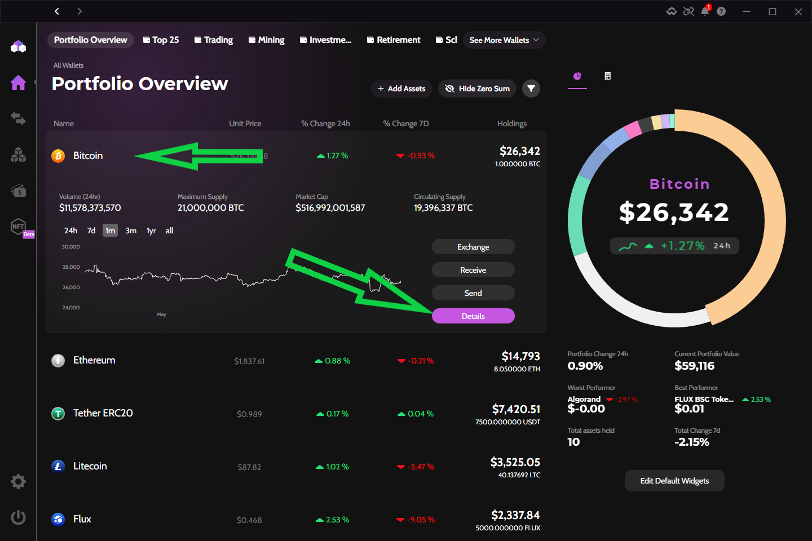
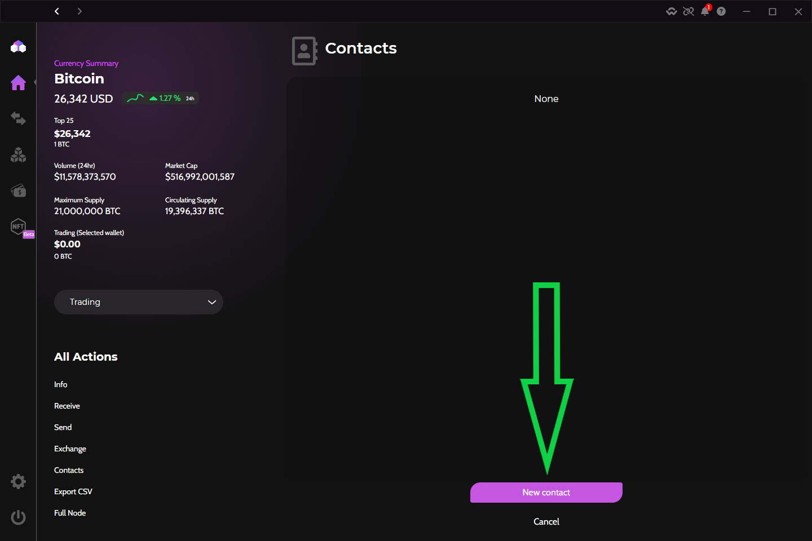
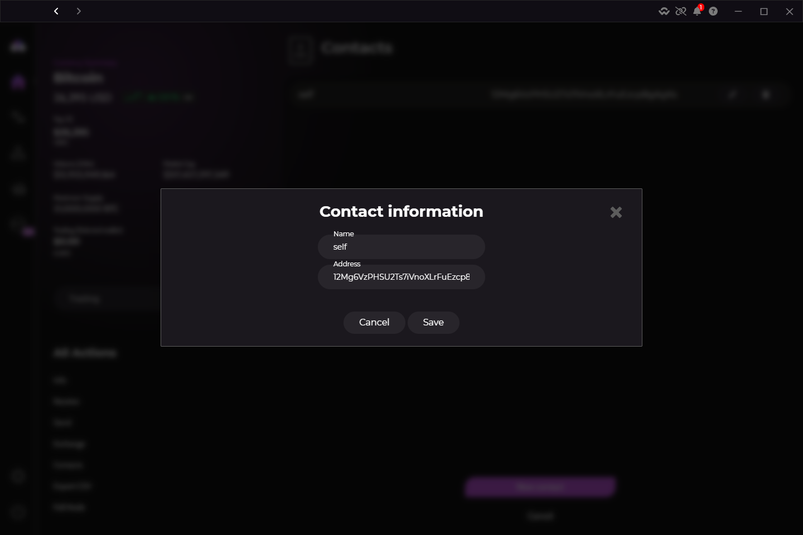
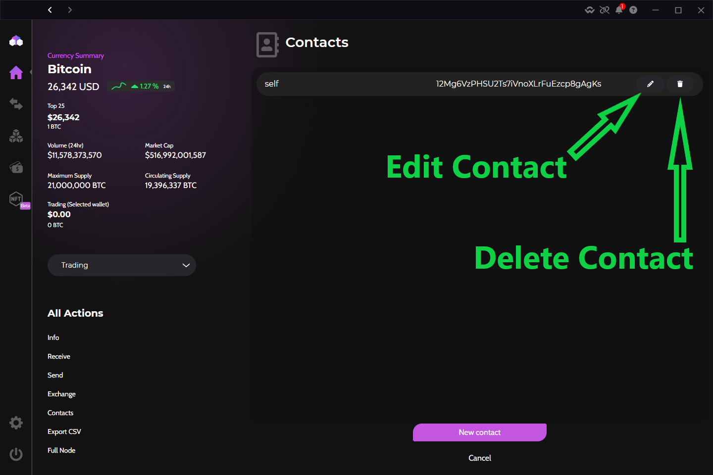

<h1> Add, Delete, and Modify Contacts & Addresses </h1>

!!! success "A Contact is the same thing as saving an address to reuse in the future. Contacts are created for individual crypto assets, not for the entire wallet."

### Add a new Contact

1. From the Portfolio Overview screen (home screen), select the asset you want to add a Contact for.
2. Select the "Details" button to display more information about the asset.
3. In the lower left corner, select the "Contacts" button.
4. Select the pink "New Contact" button. An input field will pop up.
5. Name this new Contact and paste in the address you want to save. Then tap "Save".
6. The Contact is now saved in your Zelcore wallet for future use.

### Delete a Contact
1. From the Contacts screen, select the "Trash Can" icon to delete the desired Contact.
2. The Contact will be deleted forever. So be careful!

### Modify a Contact
1. From the Contacts screen, select the "Pencil" icon to modify the Contact.
2. You can now change either the Contact Name, the crypto Address, or both.
3. Tap the "Save" button to confirm your Contact changes.

### Steps in pictures

=== "Select Asset"
    <figure markdown>
        { width="600" }
        <figcaption>Select the asset you want to add a Contact for</figcaption>
    </figure>

=== "Add Contact"
    <figure markdown>
        { width="600" }
        <figcaption>Tap the pink "New Contact" button</figcaption>
    </figure>

=== "Enter Contact Info"
    <figure markdown>
        { width="600" }
        <figcaption>Enter the Contact name and crypto address</figcaption>
    </figure>

=== "Edit/Delete Contact"
    <figure markdown>
        { width="600" }
        <figcaption>Tap the "Pencil" icon to edit or the "Trash Can" icon to delete a Contact</figcaption>
    </figure>