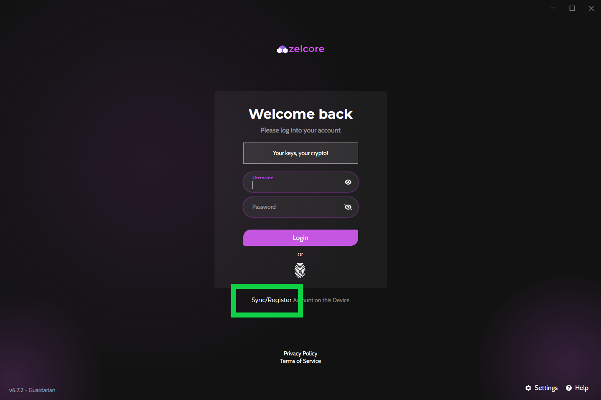
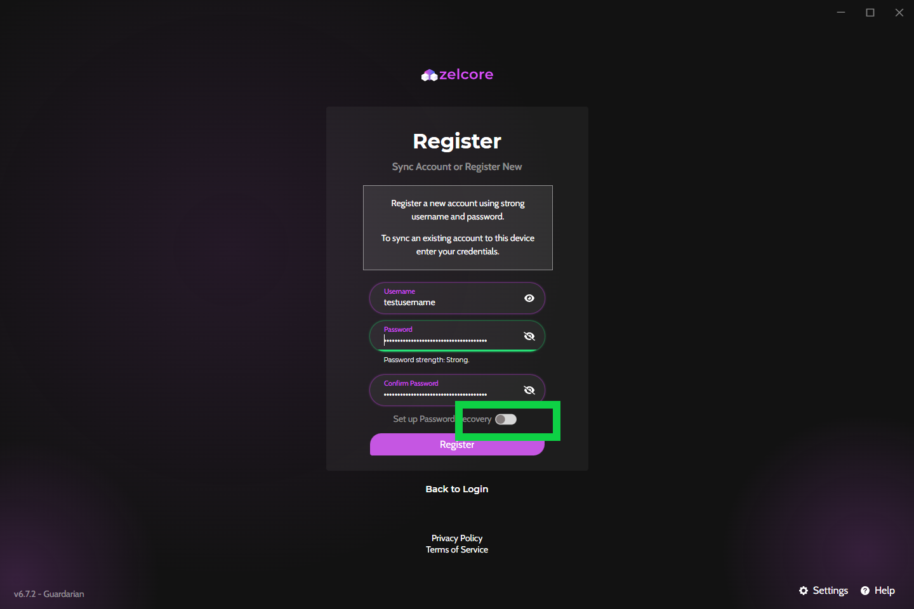
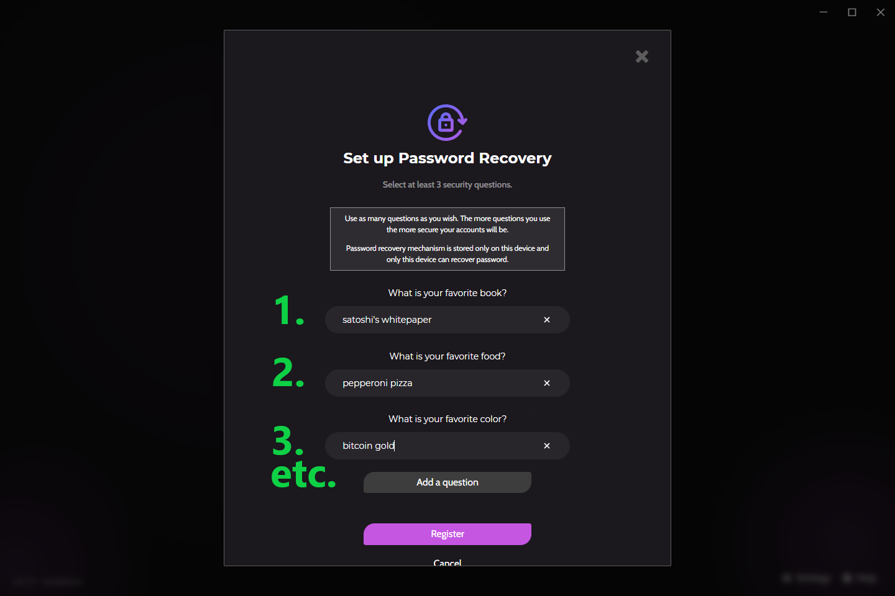

??? tip "For best security, use a unique, strong, and long username/password combination"

    * Don't re-use credentials from your other services (e.g. banking, email, etc.)
    * Make username and password as long as possible
    * Consider using a password manager for Zelcore and your other logins

<h2> 1. Open Zelcore and tap "Sync/Register" Account on this Device </h2>

<h2> 2. Type your desired username and password </h2>

???+ warning "Your username & password is not recoverable by Zelcore for your protection"

    * Write down your username/password on paper and store in a secure location
    * Treat your username & password the same way you handle private keys
    * Do not share your username/password with anyone!

<h2> 3. <b><u>Optional but encouraged:</b></u> Tap the toggle for "Set up Password Recovery" </h2>

<h2> 4. Select as many security questions as you wish and provide answers to each question </h2>

??? tip "This recovery feature stays local to your device"

    If you have multiple devices, you should enable password recovery on each device

<h2 > 5. Register the account </h2>

<h2> 6. Log in with your new username & password </h2>

??? tip "You must type your username and password exactly as you registered. A different letter/number, space, character, etc. will result in a different account"

<h2> Steps in pictures </h2>

=== "Step 1"
    <figure markdown>
        { width="600" }
        <figcaption>Open Zelcore and tap "Sync/Register" Account on this Device</figcaption>
    </figure>

=== "Step 2"
    <figure markdown>
        { width="600" }
        <figcaption>Type your desired username and password</figcaption>
    </figure>

=== "Step 3/Step 4"
    <figure markdown>
        { width="600" }
        <figcaption>Tap the toggle for "Set up Password Recovery"</figcaption>
    </figure>