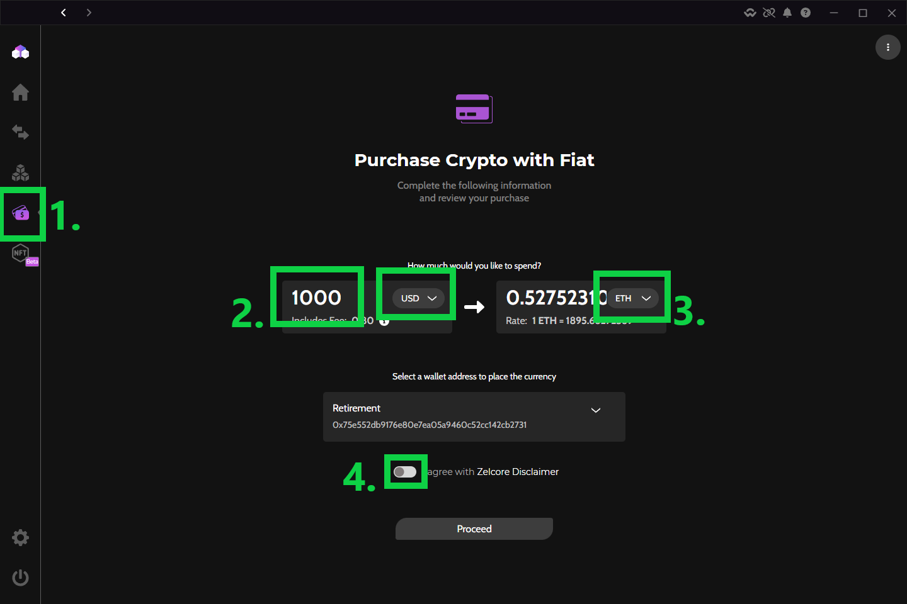
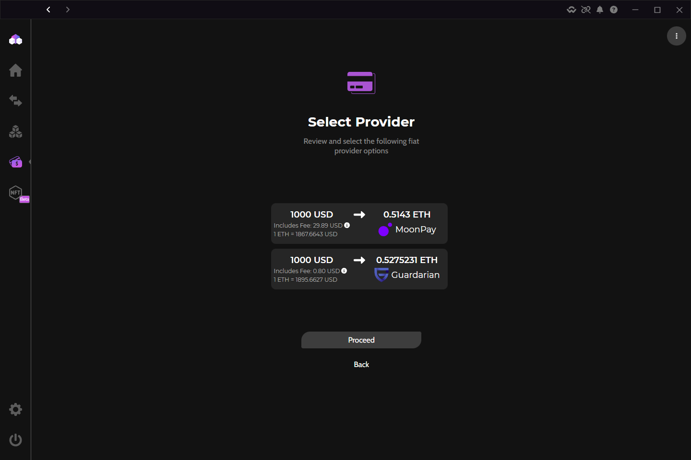
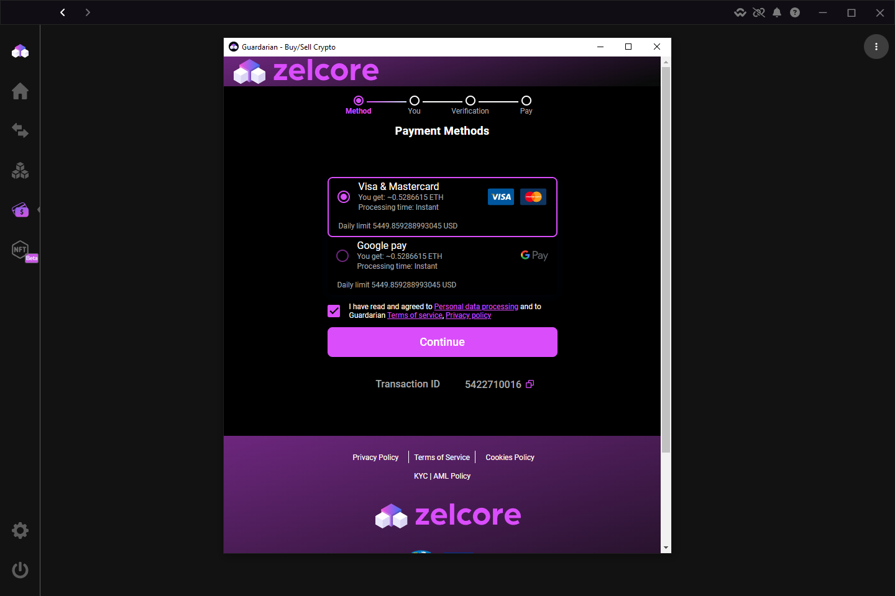

<h1> How to Buy Crypto in Zelcore </h1>

1. On the left toolbar, select the "Purchase" button.
    * Zelcore checks rates from multiple providers and allows you to choose your preferred offer.
2. Type the amount you want to pay in the left box and select your local currency.
3. Select the crypto you want to buy in the right box dropdown. 
4. Read the terms of service, and activate the slider if you accept the terms. Proceed to the next screen.
5. Offers from our providers will show up with the market price and fees. Tap the offer you want to take.
6. Each provider has their own secure portal with their own unique steps. Follow the directions to complete your purchase.
7. After completing the purchase, your crypto will be delivered to your Zelcore wallet. This typically takes 1-2 minutes, though can take longer for blockchains with long confirmation times.

??? tip "Banking and crypto laws are wildly different between countries, states, and even locales"

    * Our providers might require you to provide personal information to satisify their "Know Your Customer" (KYC) and "Anti-Money Laundering" (AML) requirements depending on your location.
    * There are limits to the amount of money you can spend via credit/debit cards, ACH's, and Wire transfers that differ by locale.
    * For the quickest support, it's best to reach out to the service provider for questions/issues as Zelcore does not store any of your personal transaction information.

### Steps in pictures

=== "Steps 1-4"
    <figure markdown>
        { width="600" }
        <figcaption> Go to "Purchase" screen</figcaption>
    </figure>

=== "Step 5"
    <figure markdown>
        { width="600" }
        <figcaption> Select your preferred offer</figcation>
    </figure>

=== "Steps 6-7"
    <figure markdown>
        { width="600" }
        <figcaption> Complete your purchase</figcaption>
    </figure>