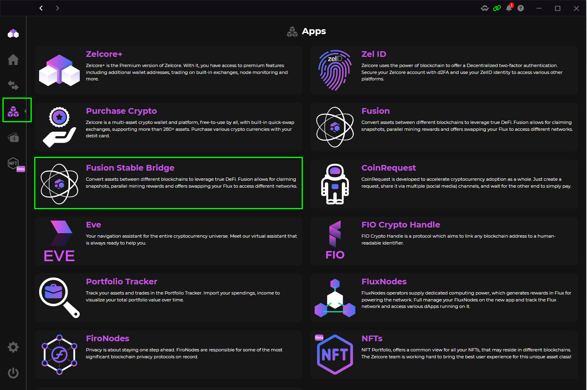
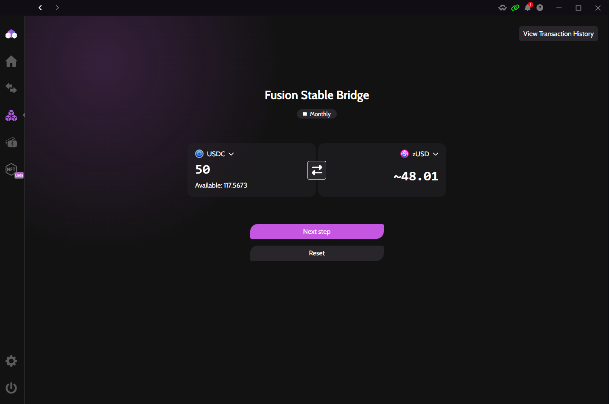
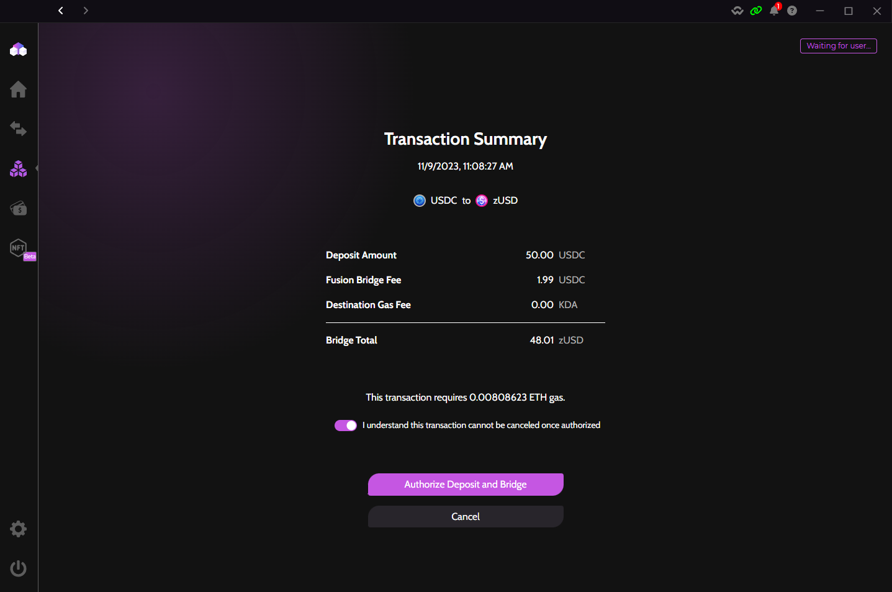
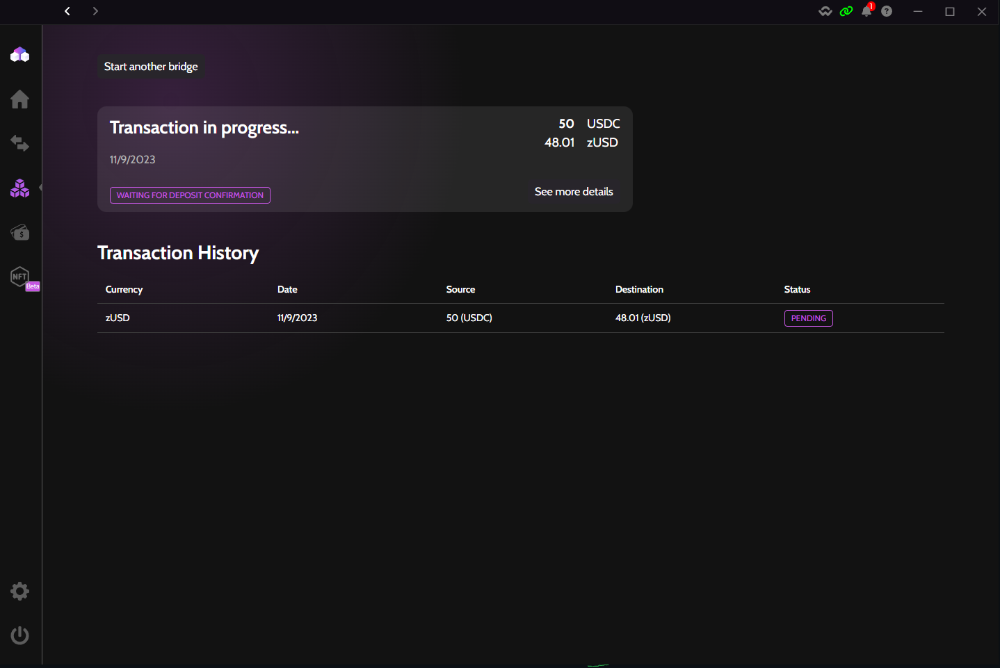
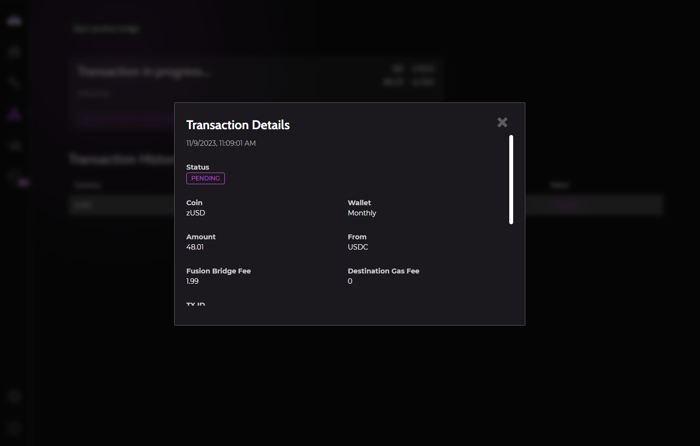
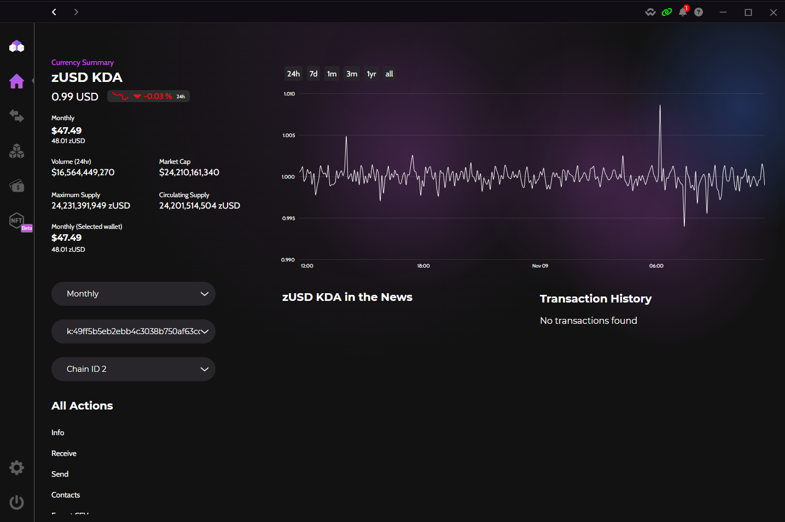

<h1> How to get zUSD on Kadena </h1>

<h3> Zelcore's Fusion Stable Bridge is a hybrid centralized/decentralized bridge between the ETH and KDA networks. We plan to add more networks and more variants of stablecoins. </h3>

!!! info
    Currently the Fusion Bridge takes USDC-ETH (Ethereum gas fees apply) and converts it to zUSD, the first stable coin on Kadena. It also bridges back from zUSD -> USDC-ETH

    Unfortunately, ETH gas fees are typically more expensive than other networks, and sometimes can be 100's of dollars. You can check the current ETH gas fees at <a href="https://etherscan.io/gastracker"> Etherescan Gas Tracker </a>.

    Using zUSD on eckoDEX and bridging out of zUSD on the KDA side is free thanks to Kadena's gas stations. The ETH gas needed to bridge out of Kadena will be taken out of the zUSD balance and Fusion Bridge will pay the ETH gas fee in $ETH.

### Steps in pictures
<h3> Directions for each step are below each picture. </h3>

=== "Step 1"
    <figure markdown>
        { width="900" }
        <figcaption> Once logged into Zelcore, tap the "Apps" button in the
        left toolbar and select "Fusion Stable Bridge" app.</figcaption>
    </figure>

=== "Step 2"
    <figure markdown>
        { width="900" }
        <figcaption> Put in how much USDC-ETH you want to bridge to zUSD on Kadena and tap "Next Step" button.</figcaption>
    </figure>

=== "Step 3"
    <figure markdown>
        { width="900" }
        <figcaption> Review the details of your transaction. Notice the amount
        of ETH gas required to complete the transaction. Tap "Authorize Deposit
        and Bridge" button to instantly start the Bridge.</figcaption>
    </figure>

=== "Step 4"
    <figure markdown>
        { width="900" }
        <figcaption> You will be taken to the Bridge status page. The transaction might take a few minutes depending on network congestion. Multiple smart contracts are being executed.</figcaption>
    </figure>

=== "Step 5"
    <figure markdown>
        { width="900" }
        <figcaption> You can view the details of your transaction by tapping on the entry for the pending Bridge.</figcaption>
    </figure>

=== "Step 6"
    <figure markdown>
        { width="900" }
        <figcaption> If you do not have the zUSD asset added to Zelcore, now is a good time to go to the home page and enable it by tapping "Add Asset" and selecting zUSD from the Kadena Network section. Your balance of zUSD should show up momentarily.</figcaption>
    </figure>

!!! warning
    zUSD uses Chain 2 on Kadena, the same chain as eckoDex

