!!! danger "Hardware wallet support is experimental. Use at your own discretion"
!!! warning "Hardware wallet support must be enabled since it's an experimental feature"

    - Go to Settings in the lower left toolbar.

    - In the "Extras" section, toggle on "Experimental Features".

    - You can now follow the below steps to set up your HW wallet.

### Supported Hardware Wallets

<h4> Ledger  </h4>

- [Nano S Plus](https://shop.ledger.com/pages/ledger-nano-s-plus)
- [Nano X](https://shop.ledger.com/pages/ledger-nano-x)

<h4> Trezor </h4>

* [Model One](https://trezor.io/trezor-model-one)
* [Model T](https://trezor.io/trezor-model-t)

### Add your HW Wallet to Zelcore
!!! warning ""
    - Make sure you are using Zelcore v7.0.0 or greater.
    - Enable "Experimental Features" in Settings screen.

1. Log into Zelcore & connect your Trezor/Ledger device.
2. Tap the "See More Wallets" button in the upper middle of Portfolio Overview. Select "Import a Wallet".
3. Select "Hardware Wallet".
4. Choose either "Ledger" or "Trezor" for the brand of hardware wallet you are using.
5. Type in a name for your imported hardware wallet (e.g. "Ledger").
6. Select your first asset to add to your imported wallet.
7. Give the hardware wallet time to calculate all your addresses. Select which address you wish to import.
8. Confirm on your device that the address displayed in Zelcore matches the one displayed on your hardware wallet.
9. Either choose to add more assets/addresses from your hardware wallet or skip to Step 11 to complete the import.
10. Follow steps 6-8 to add as many assets and addresses as you wish.
11. After finishing all steps on Zelcore, tap the "Close" button to finish the import.
12. Navigate to your new Zelcore wallet that imported all your hardware wallet addresses.
13. If your addresses have balances that are not showing up in Zelcore, select the "Smartify" option to force Zelcore to query all address balances now.

??? tip "Imported Address Not Showing Up?"
    If you do not see your coin after importing a HW wallet address, select "Show Zero Sum" button. This happens if the address is empty.

### Steps in pictures

=== "Step 0"
    <figure markdown>
        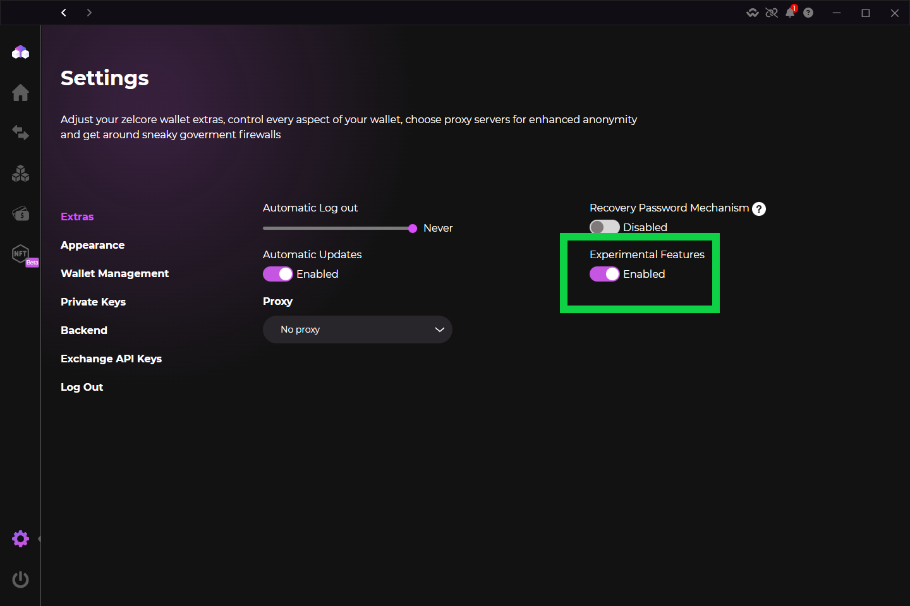{ width="600" }
        <figcaption>Enable Experimental Features in Settings</figcaption>
    </figure>

=== "Step 1"
    <figure markdown>
        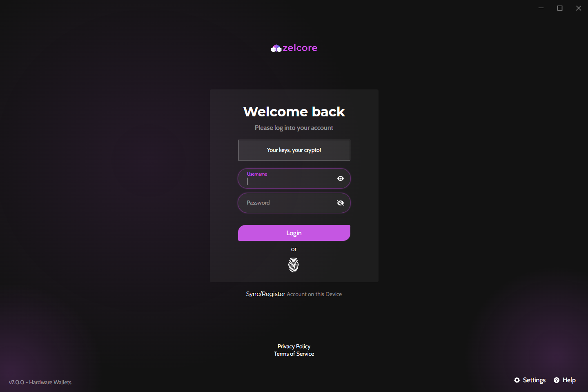{ width="600" }
        <figcaption>Log into your Zelcore account</figcaption>
    </figure>

=== "Step 2"
    <figure markdown>
        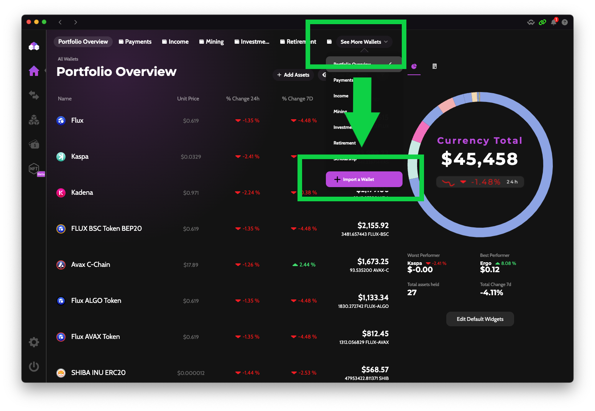{ width="600" }
        <figcaption>Tap the "See More Wallets" button in the upper middle of Porfolio Overview</figcaption>
    </figure>

=== "Step 3"
    <figure markdown>
        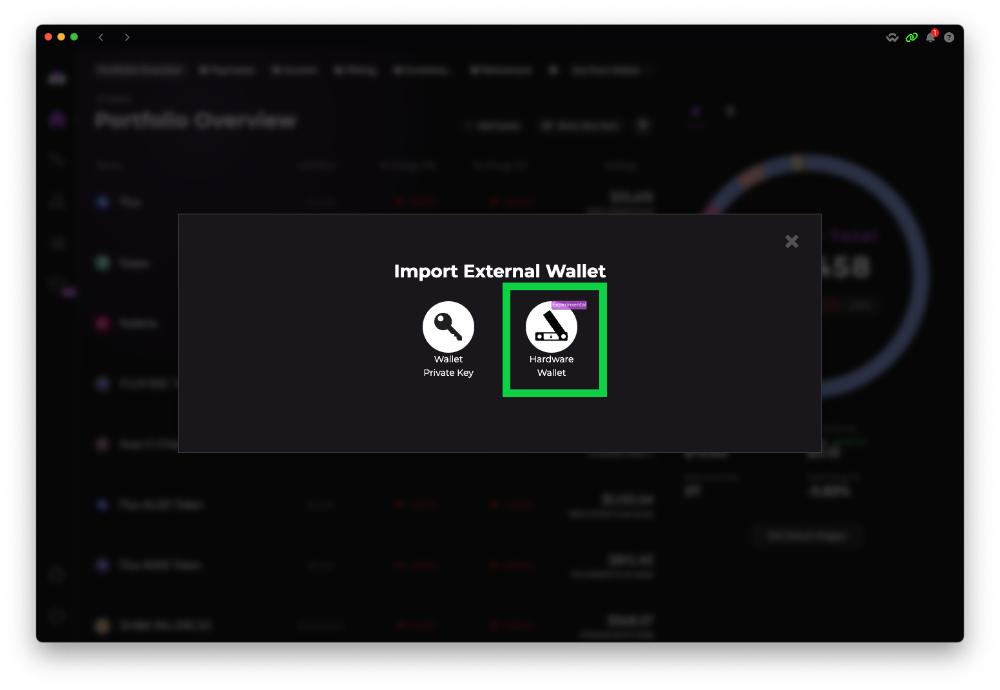{ width="600" }
        <figcaption>Select the "Hardware Wallet" icon</figcaption>
    </figure>

=== "Step 4"
    <figure markdown>
        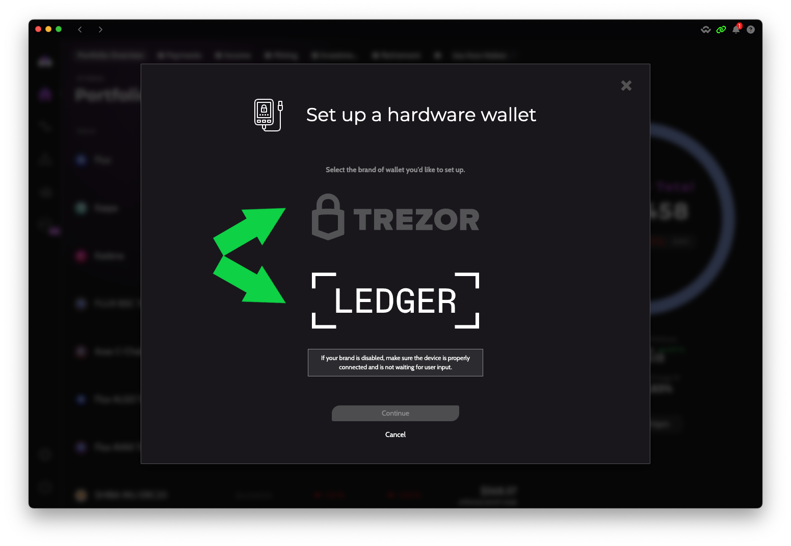{ width="600" }
        <figcaption>Choose either Ledger or Trezor</figcaption>
    </figure>

=== "Step 5"
    <figure markdown>
        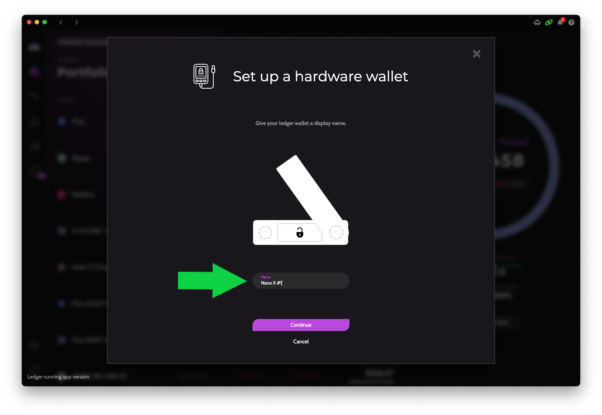{ width="600" }
        <figcaption>Type in a name for your new wallet</figcaption>
    </figure>

=== "Step 6"
    <figure markdown>
        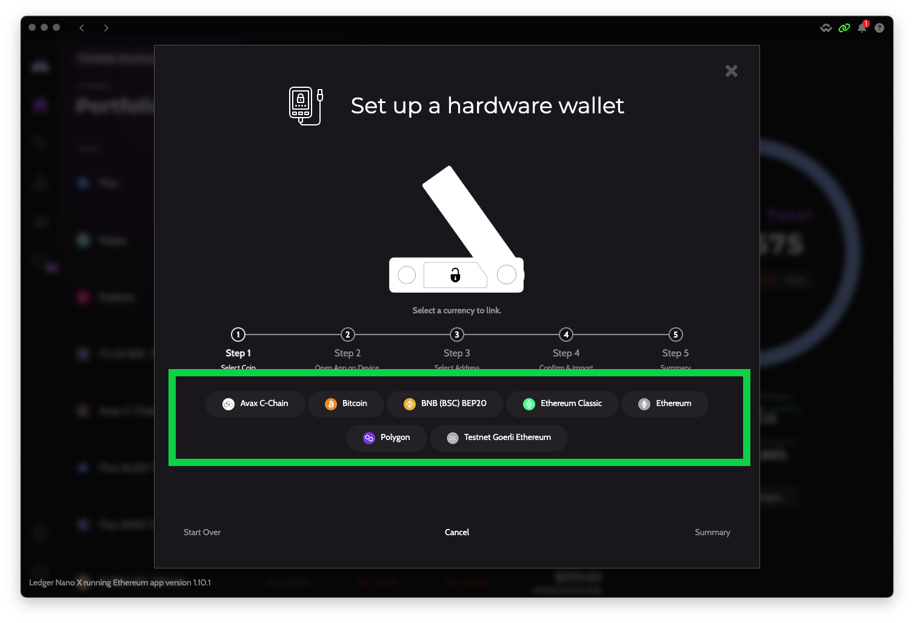{ width="600" }
        <figcaption>Select your first asset to add to your imported wallet</figcaption>
    </figure>

=== "Step 7"
    <figure markdown>
        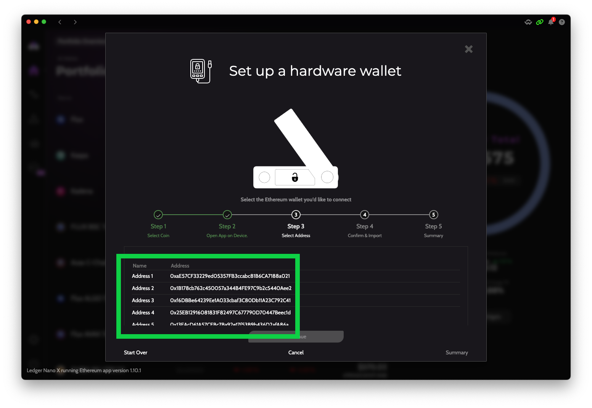{ width="600" }
        <figcaption>Select which address you wish to import</figcaption>
    </figure>

=== "Step 8"
    <figure markdown>
        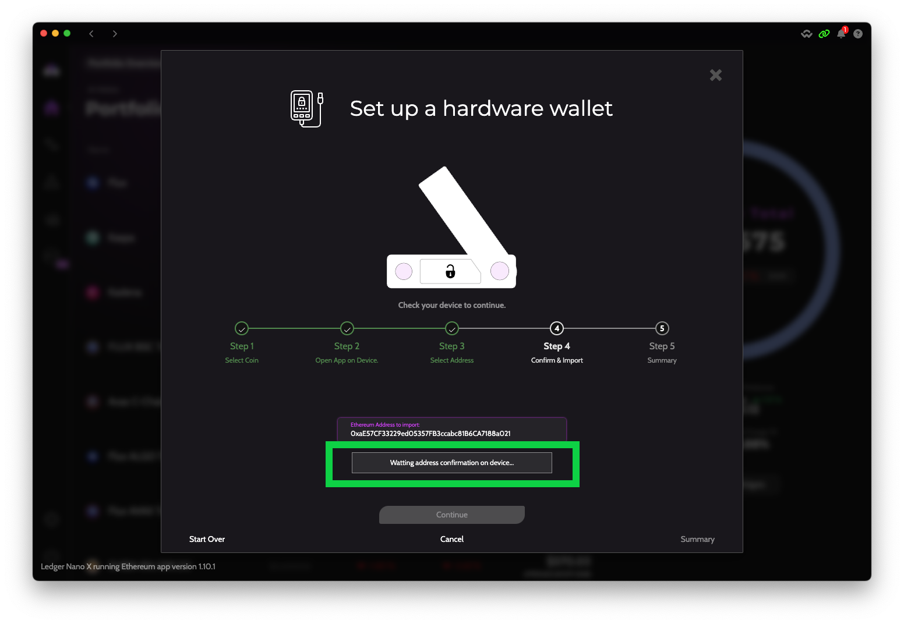{ width="600" }
        <figcaption>Confirm on your device that the address displayed in Zelcore matches the one displayed on your hardware wallet</figcaption>
    </figure>

=== "Step 9"
    <figure markdown>
        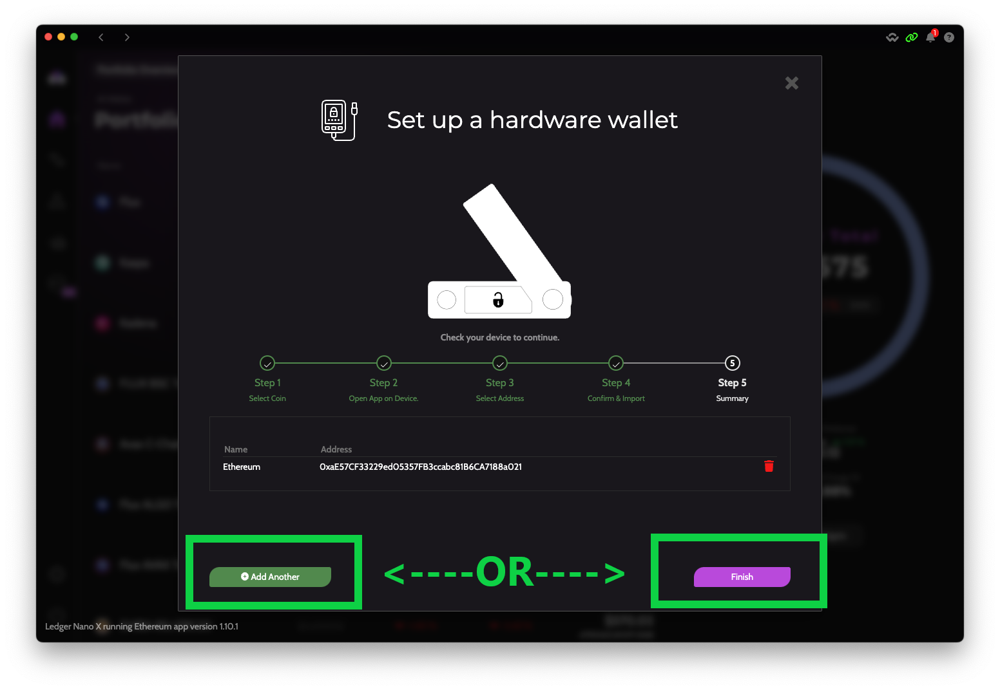{ width="600" }
        <figcaption>Either choose to add more assets/addresses from your hardware wallet or skip to Step 11 to complete the import</figcaption>
    </figure>

=== "Step 10"
    <figure markdown>
        { width="600" }
        <figcaption>Follow steps 6-8 to add as many assets and addresses as you wish</figcaption>
    </figure>

=== "Step 11"
    <figure markdown>
        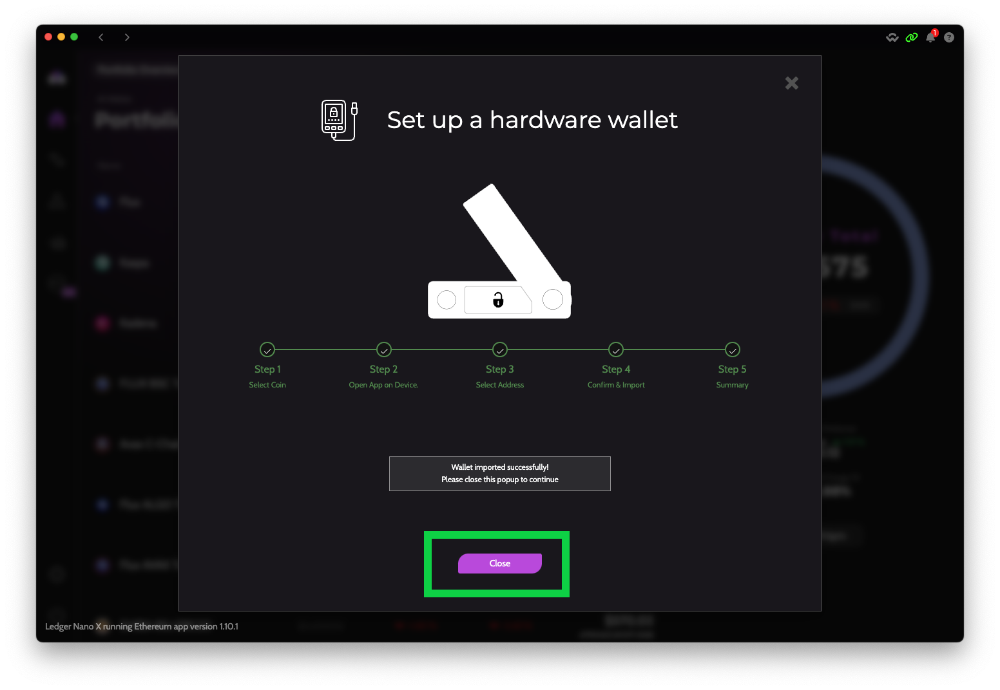{ width="600" }
        <figcaption>After finishing all steps on Zelcore, tap the "Close" button to finish the import</figcaption>
    </figure>

=== "Step 12"
    <figure markdown>
        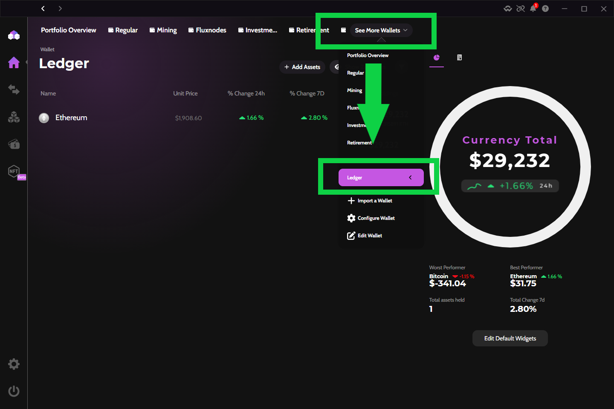{ width="600" }
        <figcaption>Navigate to your new Zelcore wallet that imported all your hardware wallet addresses</figcaption>
    </figure>

=== "Step 13"
    <figure markdown>
        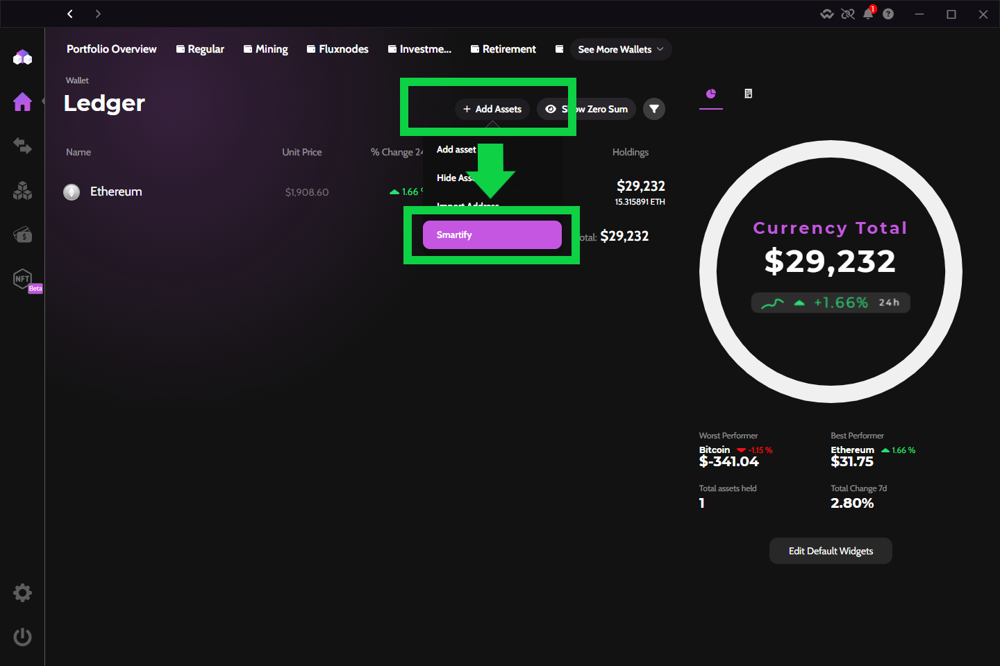{ width="600" }
        <figcaption>If your addresses have balances that are not showing up in Zelcore, select the "Smartify" option to force Zelcore to query all address balances now</figcaption>
    </figure>
