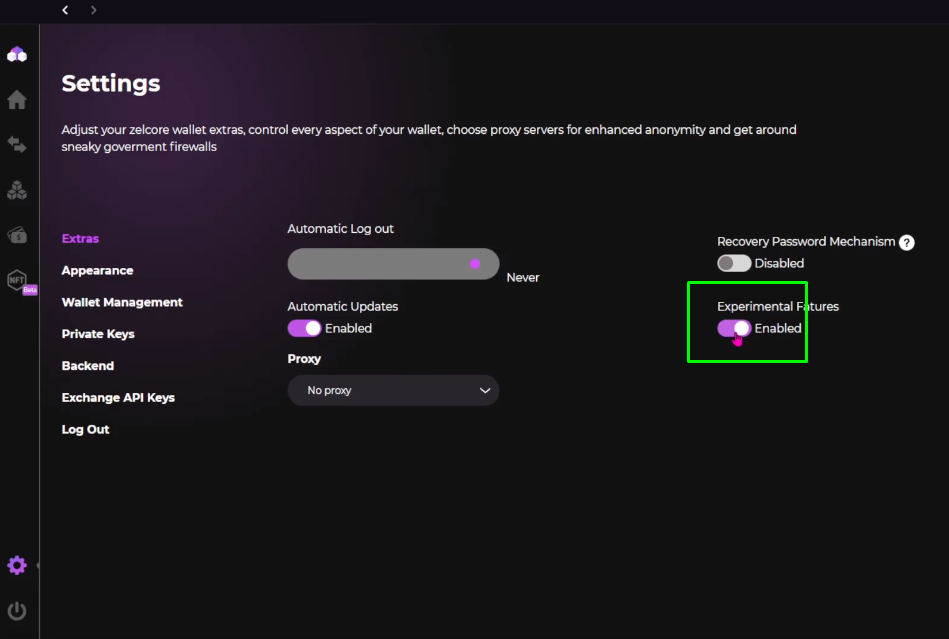
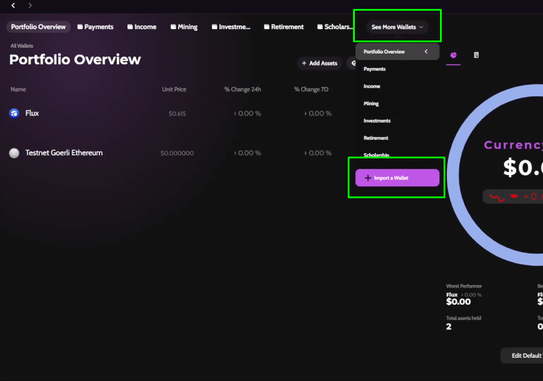
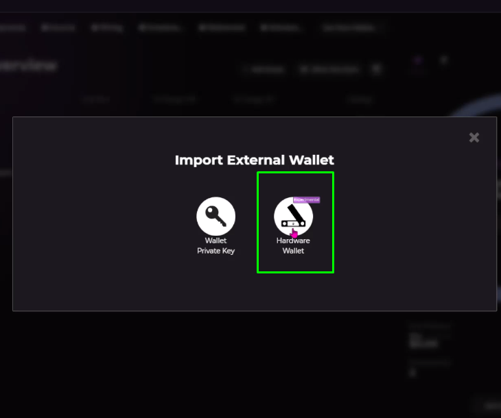
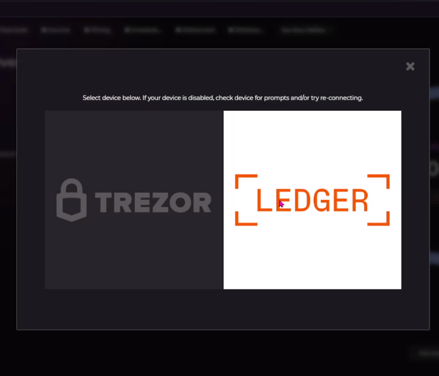
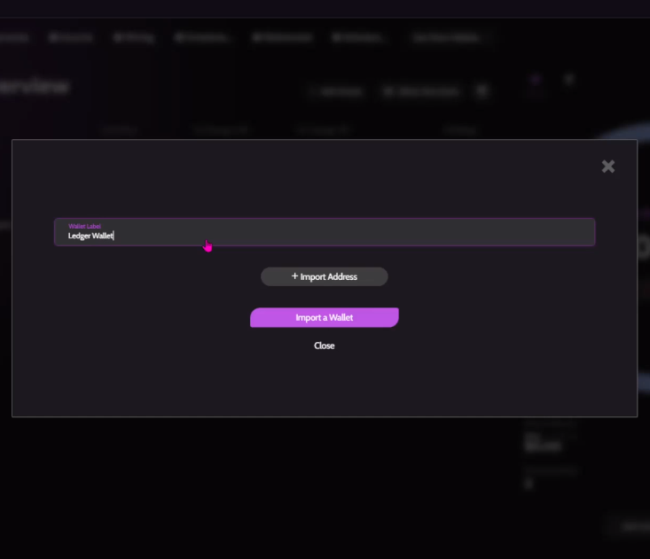
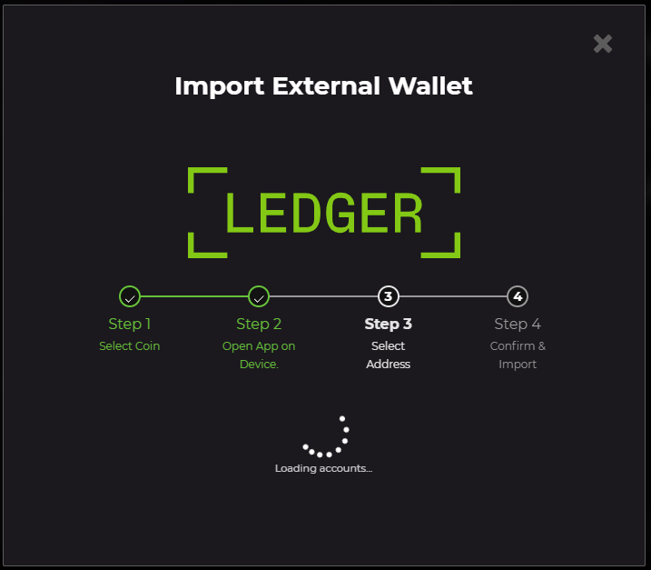

!!! tip "Zelcore now supports Ledger & Trezor"
!!! danger "Hardware wallet support is experimental. Use at your own discretion"

### Supported Hardware Wallets

<h4> Ledger  </h4>

- [Nano S Plus](https://shop.ledger.com/pages/ledger-nano-s-plus)
- [Nano X](https://shop.ledger.com/pages/ledger-nano-x)

<h4> Trezor </h4>

* [Model One](https://trezor.io/trezor-model-one)
* [Model T](https://trezor.io/trezor-model-t)

### Add your HW Wallet to Zelcore

!!! warning "Hardware wallet support must be enabled since it's an experimental feature"

    - Go to Settings in the lower left toolbar.

    - In the "Extras" section, toggle on "Experimental Features".

    - You can now follow the below steps to set up your HW wallet.

1. Log into Zelcore & connect your Trezor or Ledger device.
2. Tap the "See More Wallets" button in the upper middle of Portfolio Overview.
3. Select "Import a Wallet".
4. Select the "Hardware Wallet" icon.
5. Choose either "Ledger" or "Trezor".
6. Name your wallet (e.g. "Ledger Wallet") and select which asset to import.
7. Follow the directions on-screen to import your HW wallet addresses.

!!! note "Imported Address Not Showing Up?"
    If you do not see your coin after importing a HW wallet address, select "Show Zero Sum" button. This happens if the address is empty.

### Steps in pictures

=== "Enable"
    <figure markdown>
        
        <figcaption>Enable Experimental Features in Settings</figcaption>
    </figure>

=== "Step 2"
    <figure markdown>
        
        <figcaption>Tap the "See More Wallets" button in the upper middle of Porfolio Overview</figcaption>
    </figure>

=== "Step 4"
    <figure markdown>
        
        <figcaption>Select the "Hardware Wallet" icon</figcaption>
    </figure>

=== "Step 5"
    <figure markdown>
        
        <figcaption>Choose either "Ledger" or "Trezor"</figcaption>
    </figure>

=== "Step 6"
    <figure markdown>
        
        <figcaption>Name your wallet (e.g. "Ledger Wallet") and select which asset to import</figcaption>
    </figure>

=== "Step 7"
    <figure markdown>
        
        <figcaption>Follow the directions on-screen to import your HW wallet addresses</figcaption>
    </figure>
