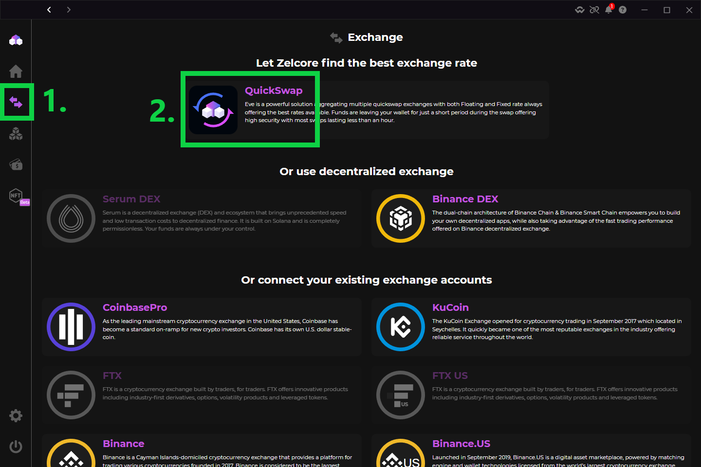
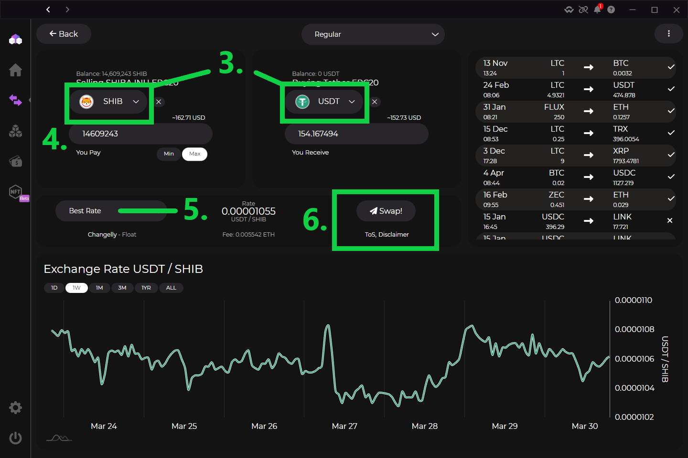
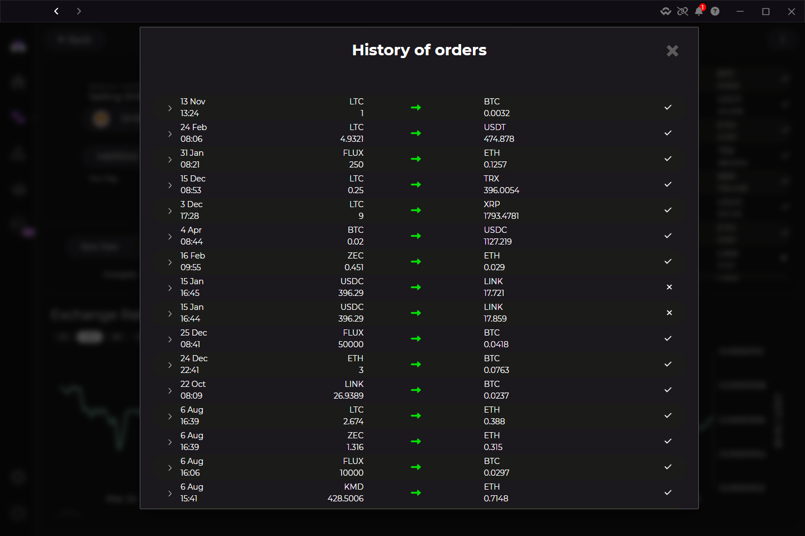

<h1> How to Swap Crypto In Zelcore </h1>

1. On the left toolbar, select the "Exchange" button.
    * Zelcore checks rates from multiple providers to find the best options.
2. To swap one crypto to another crypto, select "QuickSwap"
3. From the two dropdown menus, select your "Selling" and "Buying" cryptos.
    * "Selling" asset is the coin you are giving. "Buying" asset is the coin you will get.
4. Write in the amount of coin you wish to sell. The estimated value in fiat currency is also displayed.
5. By default, the trade with the best rate is automatically displayed. You may select a different option if desired:
    * Best Rate
    * Fixed Rate
    * By Provider
6. Tap the "Swap" button to start the transaction. Your swap history is shown in the upper right.

!!! tip ""
    By starting the transaction, you also accepting the 3rd party provider's Terms of Service and Zelcore's Disclaimer. Be sure to read those before swapping.

:warning: Swap times vary depending on which assets are selected :warning:

```
Swapping ERC20 to ERC20 normally takes 1-2 minutes
while Buying/Selling Bitcoin may take >30 minutes
because of block confirmation times.
```

### Steps in pictures

=== "Steps 1-2"
    <figure markdown>
        { width="600" }
        <figcaption> Launch QuickSwap aggregator</figcaption>
    </figure>

=== "Steps 3-6"
    <figure markdown>
        { width="600" }
        <figcaption> Set up your swap and execute</figcaption>
    </figure>

=== "Swap History"
    <figure markdown>
        { width="600" }
        <figcaption> View detailed info about previous swaps</figcaption>
    </figure>
