# Buy bStocks on ZelCore Desktop

This walkthrough shows how to add tokenized US stocks (bStocks) to your ZelCore Desktop portfolio and buy one with USDT on BNB Smart Chain using the built-in swap. The example buys Microsoft (MSFTB) with 10 USDT.

If you are new to bStocks, read [bStocks in ZelCore](/docs/guides/bstocks-tokenized-stocks-guide) first. It covers what the tokens are, dividends and splits, fees, risks and the country restrictions.

---

## Prerequisites

- ZelCore Desktop 8.36 or later, logged in
- Your connection located in a country where bStocks are available (the app hides them otherwise)
- USDT (BSC) or BNB in the wallet you want to buy from
- A small amount of BNB in the same wallet for gas (the example swap cost about 0.0003 BNB)

---

## Step 1: The bStocks intro banner

The first time you open a portfolio where bStocks are available, ZelCore shows a one-time banner: **US stocks, now in your wallet**.

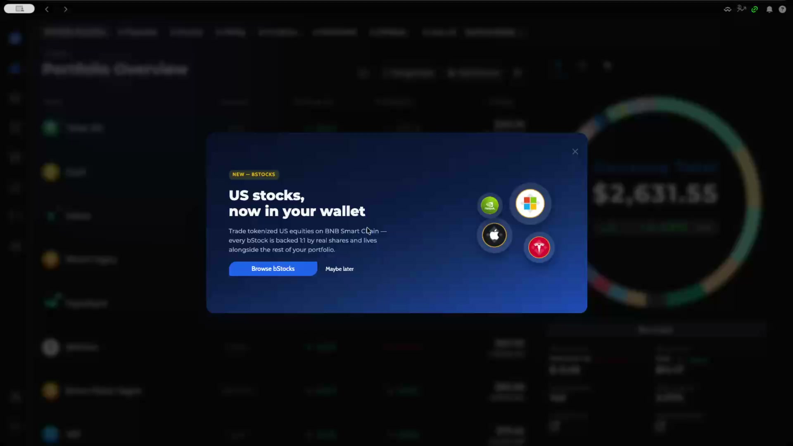

Click **Browse bStocks** to open the Add bStocks dialog directly. **Maybe later** or the **X** closes the banner and it will not appear again for this account on this device.

:::tip
You can reach the same dialog at any time from **Portfolio → Manage Assets → Add bStocks**.
:::

---

## Step 2: Browse the Add bStocks dialog

The dialog lists every available stock and ETF with its company name, ticker, live USD price and 24h change.

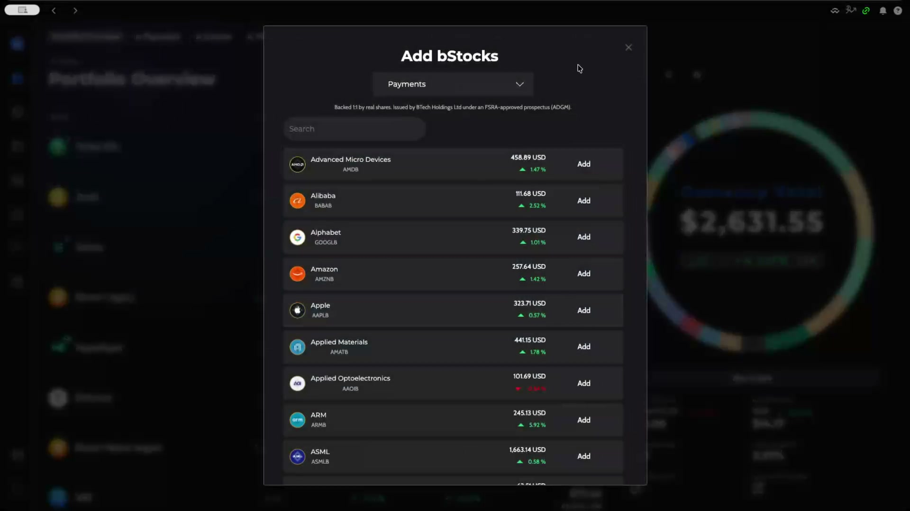

- The dropdown at the top selects the **wallet** the stock will be added to (here **Payments**). Choose the wallet that holds your USDT or BNB.
- The line under the dropdown is the issuer disclosure: *Backed 1:1 by real shares. Issued by BTech Holdings Ltd under an FSRA-approved prospectus (ADGM).*
- Use **Search** to filter by name or ticker.

Tickers follow the underlying stock plus a **B** suffix: AMDB, AAPLB, AMZNB, GOOGLB, and so on.

---

## Step 3: Add a stock

Click **Add** on a row. A green toast confirms the addition and the row switches to **Added**.

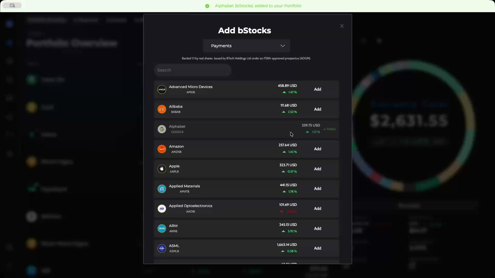

Scroll to add as many as you like. In the example, Microsoft (MSFTB) is added next.

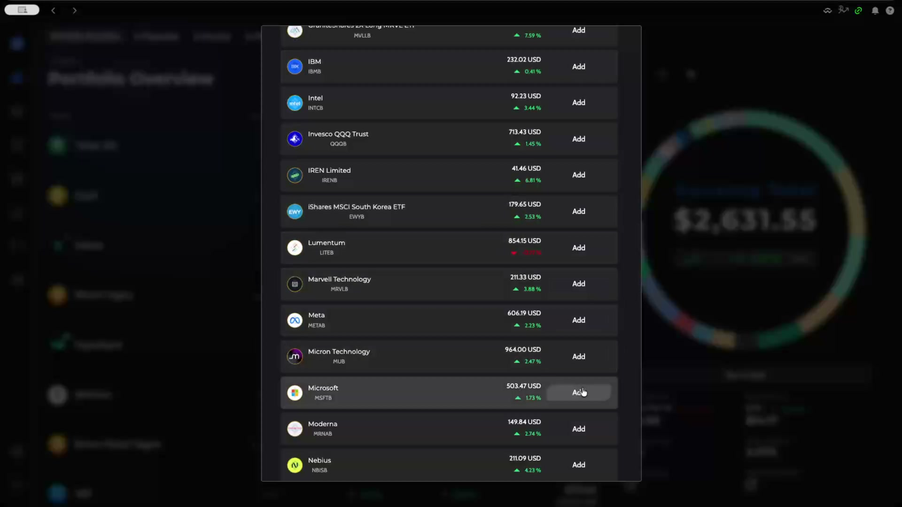

Close the dialog with the **X** when you are done. The portfolio refreshes with the new assets.

---

## Step 4: Find your bStocks in the portfolio

Back on **Portfolio Overview**, click the filter icon next to **Hide Zero Sum** and type `bsto` to show only bStocks. Each entry is named after the company with a *(bStocks)* suffix and carries the BSC badge on its icon.

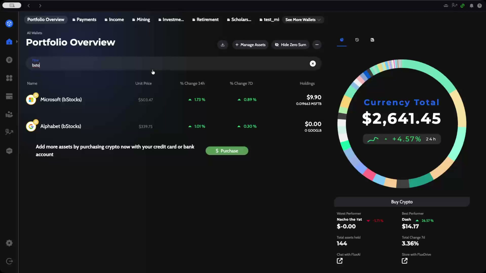

---

## Step 5: Open the stock card

Click a bStock row to expand it. The card shows 24h volume, a price chart with **24h / 7d / 1m / 3m / 1yr / all** ranges, and the action buttons **Buy, Swap, Receive, Send** and **Details**.

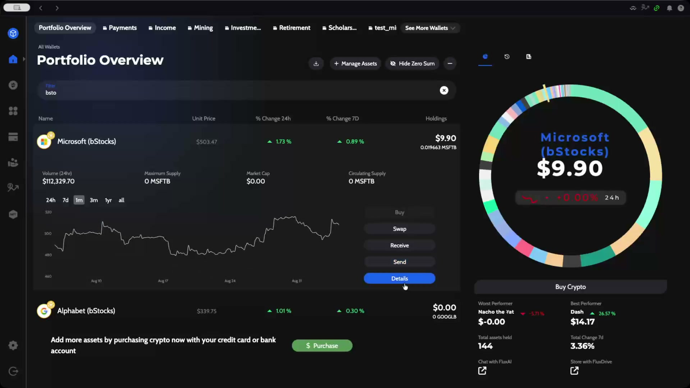

Click **Swap** to buy more of this stock, or **Details** to open the full coin page, which includes the **Tokenized US equity** chip with the current share multiplier and a **Learn more** link.

:::info
Maximum Supply, Circulating Supply and Market Cap show 0 for bStocks. Those figures are not published per token; price and volume are live.
:::

---

## Step 6: Set up the swap

**Swap Tokens** opens with the bStock preselected. The example starts with MSFTB on the *sell* side, so click the **⇄** button in the middle to move MSFTB to the *buy* side.

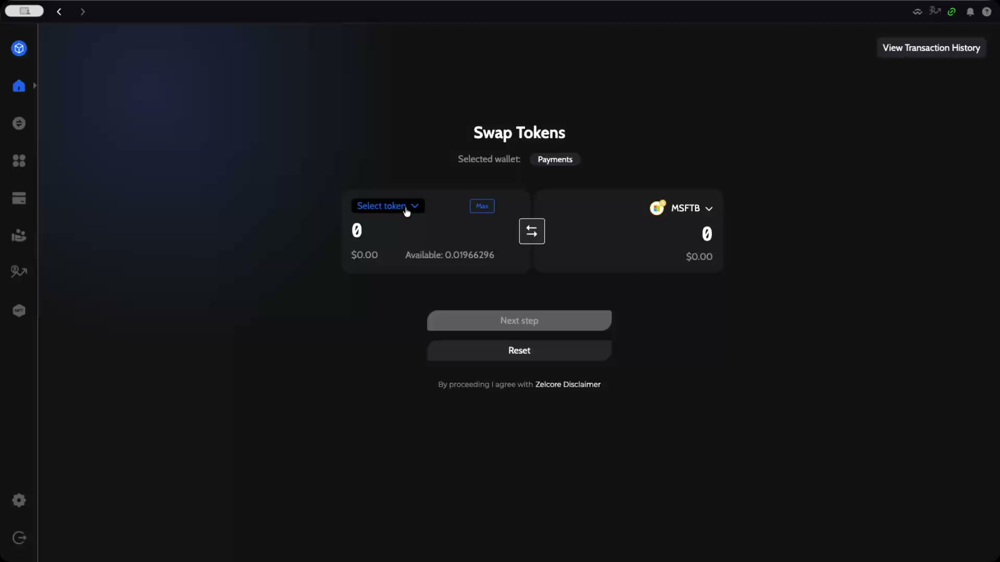

Click **Select token** on the left to choose what you pay with.

---

## Step 7: Choose the asset you pay with

The **Select asset** dialog lists every asset in the selected wallet with its balance. Search for and pick **USDT (BSC)**. BNB (BSC) BEP20 also works.

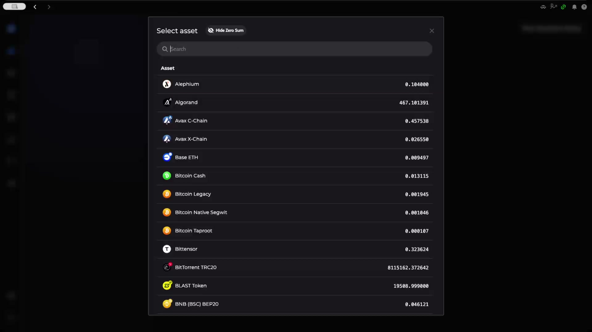

:::warning
Only BSC assets can be swapped directly into a bStock. If your USDT is on another chain (Ethereum, Solana, Tron), swap it to USDT on BSC first.
:::

---

## Step 8: Enter the amount

Type the USDT amount, or click **Max**. The example uses 10 USDT. ZelCore fetches quotes while the spinner is showing, then enables **Next step**.

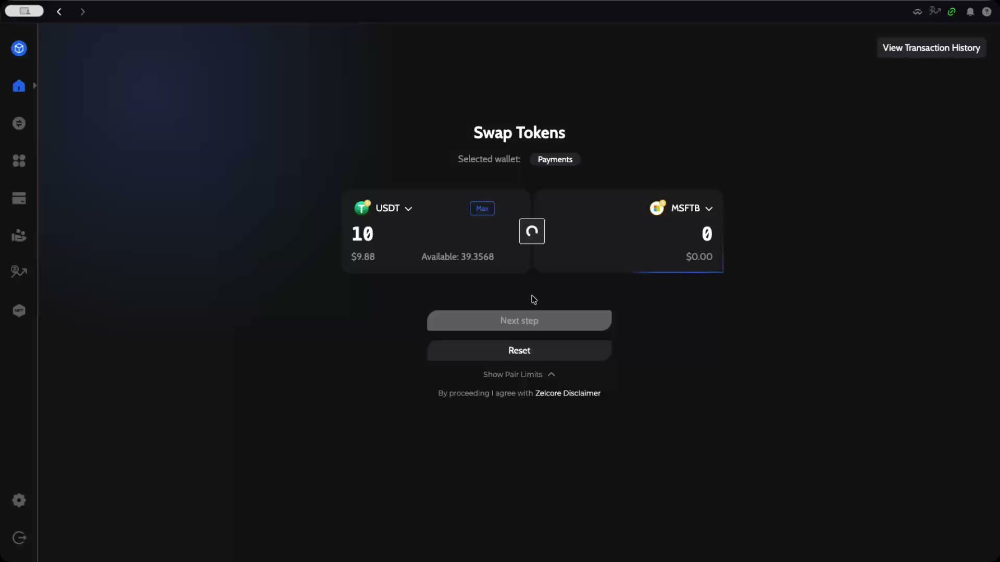

**Show Pair Limits** reveals the minimum and maximum amounts for this pair.

---

## Step 9: Select the provider

**Select Provider** lists every route that can fill the swap. **Binance Web3** is the dedicated bStocks route and is tagged **DEX** and, here, **BEST RATE**. Rango also found the pair through public liquidity pools at a slightly worse rate.

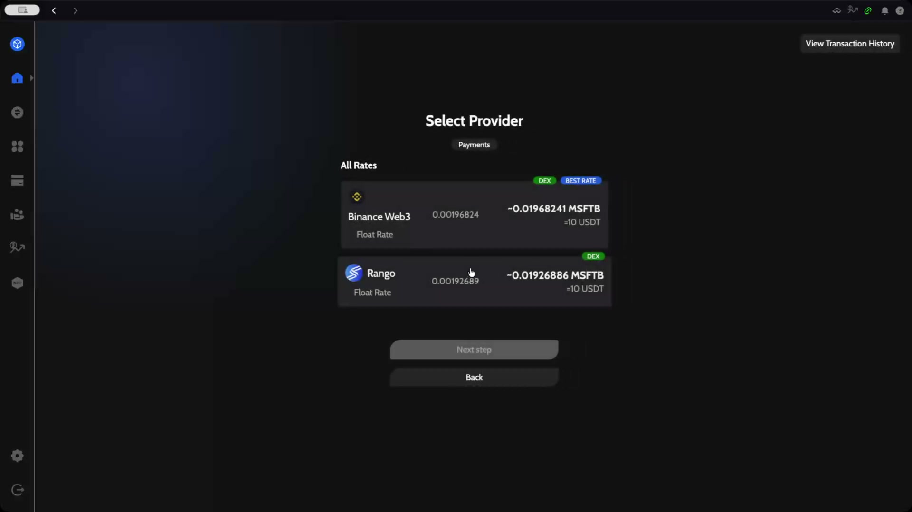

Both are **Float Rate** providers: the quote is indicative and the received amount can differ slightly. Click Binance Web3 and then **Next step**.

---

## Step 10: Review the Transaction Summary

Check everything before you sign.

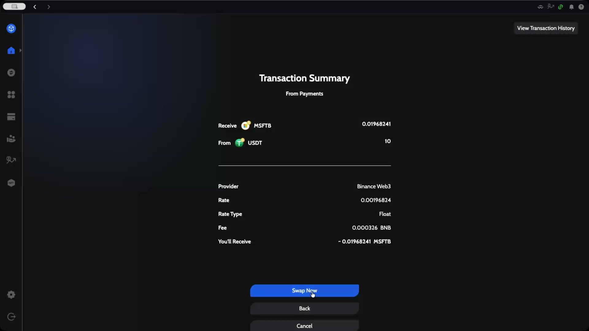

| Field | Meaning |
|-------|---------|
| **Receive / From** | 0.01968241 MSFTB for 10 USDT |
| **Provider** | Binance Web3 |
| **Rate** | MSFTB per USDT |
| **Rate Type** | Float |
| **Fee** | BSC gas paid in BNB (0.000326 BNB here) |
| **You'll Receive** | Estimated amount, prefixed with ~ because the rate floats |

Click **Swap Now**. If this wallet has never swapped USDT through this router, ZelCore first sends a one-time token approval, then the swap itself. The button shows a spinner and the top bar reads **Executing swap…** while the transactions are signed and broadcast.

---

## Step 11: Track the swap

On success the top bar shows **Swap transaction sent!** and you land on the swap history page. The new order appears in **Transaction in progress…** with status **NEW**, above the full **Transaction History** table.

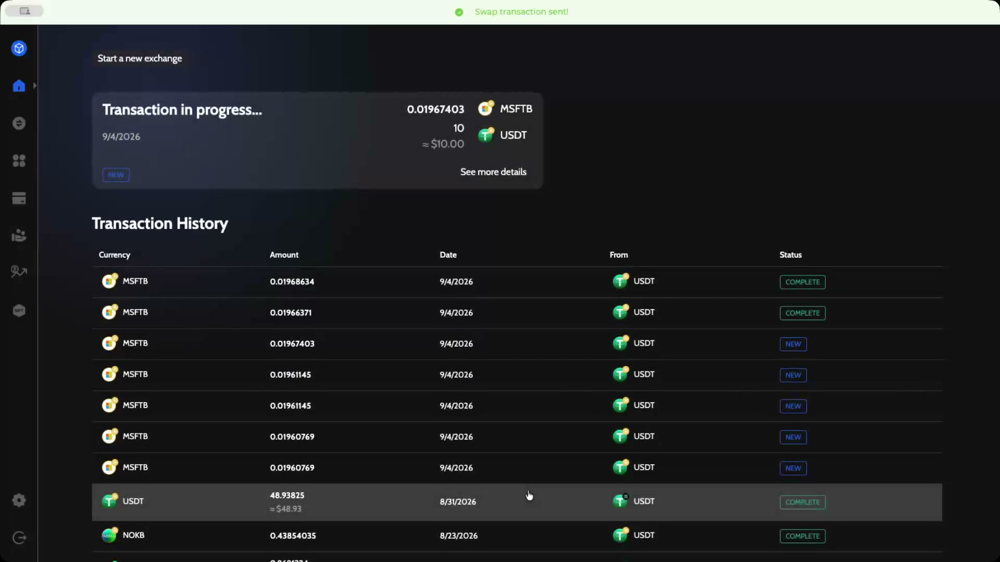

bStock swaps usually settle within a minute or two. The status changes to **COMPLETE** once the tokens are in your wallet. **Start a new exchange** takes you back to the swap form.

---

## Step 12: Transaction details

Click any row in the history to open **Transaction Details**: status, amounts, fiat value, provider, purchase rate, your BSC address and the sell transaction ID. **Track Exchange** opens the transaction in a block explorer and **Support** opens the provider's help page.

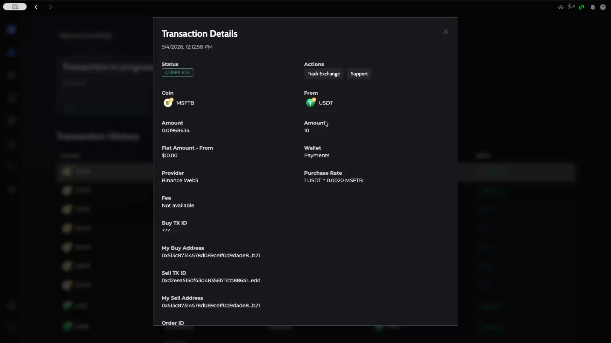

Your MSFTB balance is now visible on the Portfolio Overview and on the coin card from Step 5.

---

## Selling a bStock

Selling is the same flow in reverse: open the stock card, click **Swap**, keep the bStock on the *sell* side, choose **USDT (BSC)** as the asset to receive, and continue through provider selection and the summary.

---

## Summary

You added bStocks to a wallet through the Add bStocks dialog, opened the stock card to see its chart, and bought Microsoft (MSFTB) with 10 USDT via the Binance Web3 provider. The swap is a normal self-custodial BSC transaction: no Binance account, no KYC, and the tokens sit in your own wallet next to the rest of your portfolio.

Related:

- [bStocks in ZelCore: what they are, restrictions and risks](/docs/guides/bstocks-tokenized-stocks-guide)
- [Buy bStocks on ZelCore Mobile](/docs/walkthroughs/bstocks-mobile)
- [Troubleshooting swap issues](/docs/guides/troubleshooting-fusion-swap-issues)
