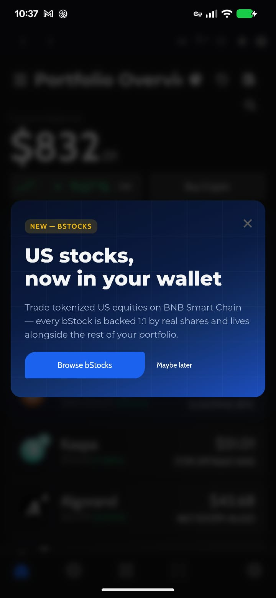
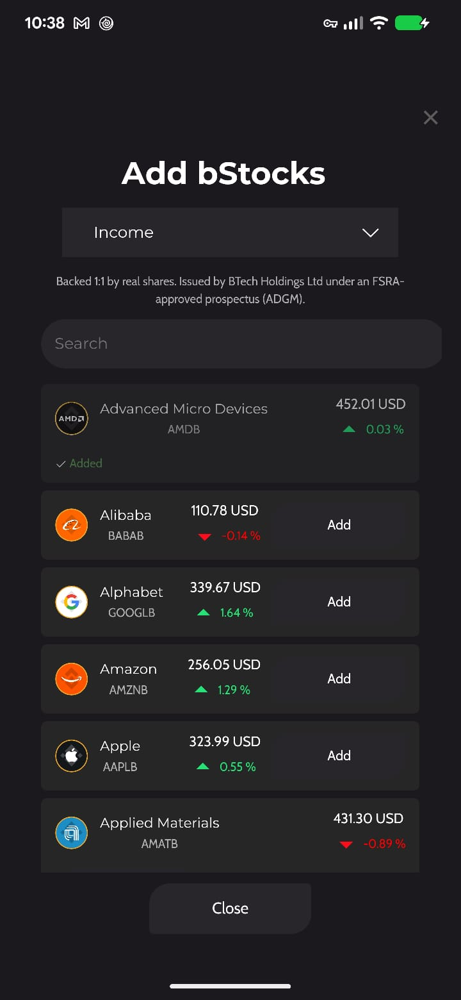
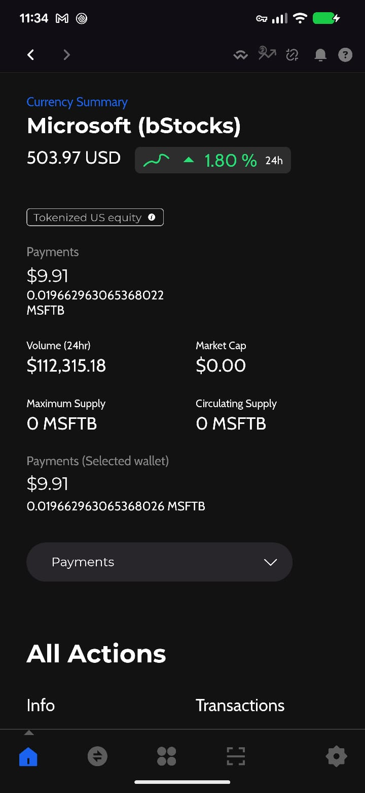
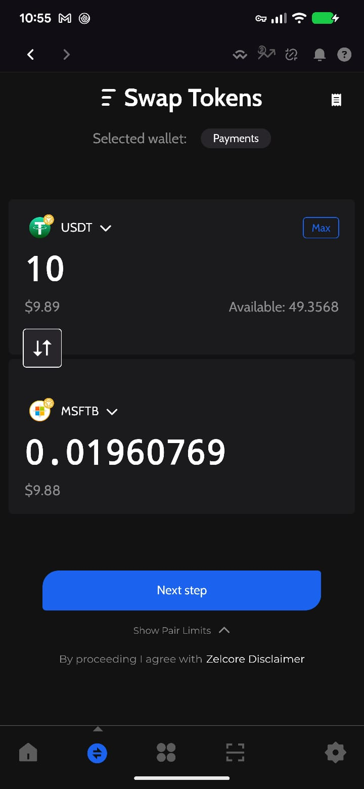
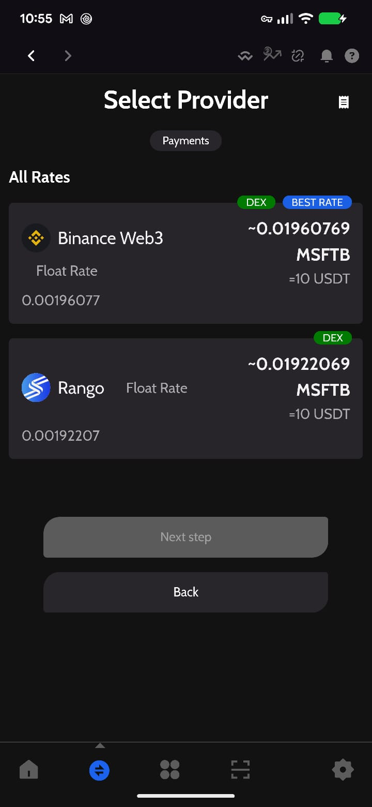
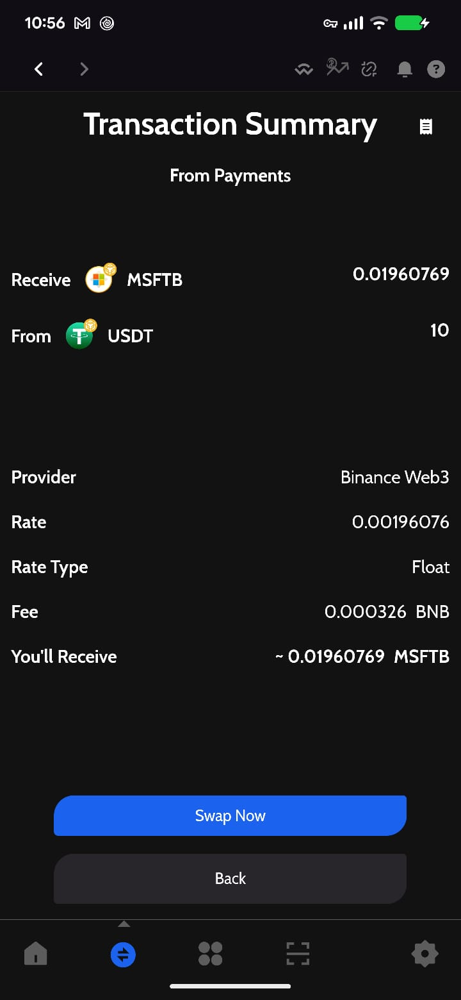

# Buy bStocks on ZelCore Mobile

This walkthrough shows how to add tokenized US stocks (bStocks) in the ZelCore mobile app and buy one with USDT on BNB Smart Chain. The screens are the same on Android and iOS. The example buys Microsoft (MSFTB) with 10 USDT.

For background on what bStocks are, dividends, fees, risks and country restrictions, read [bStocks in ZelCore](/docs/guides/bstocks-tokenized-stocks-guide).

---

## Prerequisites

- ZelCore mobile 8.36 or later, logged in
- Your connection located in a country where bStocks are available (the app hides them otherwise)
- USDT (BSC) or BNB in the wallet you want to buy from
- A little BNB in the same wallet for gas (the example swap cost about 0.0003 BNB)

---

## Step 1: The bStocks intro banner

On first login where bStocks are available, the Portfolio shows a one-time banner: **US stocks, now in your wallet**.

Tap **Browse bStocks** to open the Add bStocks screen. **Maybe later** or the **X** dismisses the banner permanently for this account on this device.

:::tip
The same screen is always available from **Portfolio → Manage Assets → Add bStocks**.
:::

---

## Step 2: Add stocks

The **Add bStocks** screen lists every available stock and ETF with its ticker, live USD price and 24h change.

1. Use the dropdown at the top to pick the **wallet** the stock will be added to (here **Income**). Choose the wallet that holds your USDT or BNB.
2. Use **Search** to filter by company name or ticker.
3. Tap **Add** on a row. It switches to **Added** with a check mark.
4. Tap **Close** when you are done. The portfolio refreshes.

The disclosure under the wallet selector reads *Backed 1:1 by real shares. Issued by BTech Holdings Ltd under an FSRA-approved prospectus (ADGM).*

---

## Step 3: Open the stock page

Tap the new asset in your portfolio to open its **Currency Summary**. You see the live price and 24h change, your balance per wallet, 24h volume, and the **Tokenized US equity** chip.

Tap the **ⓘ** on the chip for the issuer disclosure, the current share multiplier (for example *1 token = 1.002349 shares*, shown only when it differs from 1) and a **Learn more** link to the official bStocks page.

Scroll down to **All Actions** for **Send**, **Receive**, **Swap**, **Info** and **Transactions**. The portfolio row also opens a bottom sheet with a price chart and the **24h / 7d / 1m / 3m / 1yr / all** ranges.

:::info
Maximum Supply, Circulating Supply and Market Cap show 0 for bStocks. Those figures are not published per token; price and volume are live.
:::

---

## Step 4: Set up the swap

Open **Swap Tokens** from the bottom navigation bar (the ⇄ icon) or from the stock's **Swap** action.

1. Check **Selected wallet** at the top. Tap it to change wallets.
2. In the upper box tap the token name and choose **USDT (BSC)** as the asset you pay with. **BNB** also works.
3. In the lower box choose the bStock to receive, here **MSFTB**.
4. Enter the amount, or tap **Max**. The example uses 10 USDT. The lower box shows the estimated bStock amount once quotes arrive.
5. Tap **Next step**.

**Show Pair Limits** displays the minimum and maximum for this pair. The **⇅** button between the boxes flips the direction, which is how you sell a bStock back to USDT.

:::warning
Only assets on BNB Smart Chain can be swapped directly into a bStock. USDT on Ethereum, Tron or Solana must first be swapped to USDT on BSC.
:::

---

## Step 5: Select a provider

**Select Provider** shows every route that can fill the swap, tagged **DEX**. **Binance Web3** is the dedicated bStocks route and is marked **BEST RATE** here. Rango also found the pair through public pools at a slightly worse rate.

Both are **Float Rate** providers, so the final amount can differ slightly from the quote. Tap **Binance Web3**, then **Next step**.

---

## Step 6: Review and confirm

The **Transaction Summary** is the last screen before signing.

| Field | Meaning |
|-------|---------|
| **Receive / From** | 0.01960769 MSFTB for 10 USDT |
| **Provider** | Binance Web3 |
| **Rate** | MSFTB per USDT |
| **Rate Type** | Float |
| **Fee** | BSC gas paid in BNB (0.000326 BNB here) |
| **You'll Receive** | Estimated amount, prefixed with ~ because the rate floats |

Tap **Swap Now**. The first swap of USDT through this router also sends a one-time token approval before the swap itself. Confirm with your d2FA PIN if prompted. A **Swap transaction sent!** toast appears and the order is listed under swap history (the receipt icon in the top-right of the Swap screen) with status **NEW** until it settles, usually within a couple of minutes, then **COMPLETE**.

---

## Selling a bStock

Use the same Swap screen with the bStock in the upper box and **USDT (BSC)** in the lower one. Tap **⇅** to flip an existing pair. Provider selection and the summary work the same way.

---

## Summary

You added a bStock from the Add bStocks screen, checked its page and the Tokenized US equity chip, and bought Microsoft (MSFTB) with 10 USDT through Binance Web3. The tokens are held in your own BSC address in ZelCore, with no Binance account or KYC involved.

Related:

- [bStocks in ZelCore: what they are, restrictions and risks](/docs/guides/bstocks-tokenized-stocks-guide)
- [Buy bStocks on ZelCore Desktop](/docs/walkthroughs/bstocks-desktop)
- [ZelCore mobile guide](/docs/guides/zelcore-mobile-guide)
