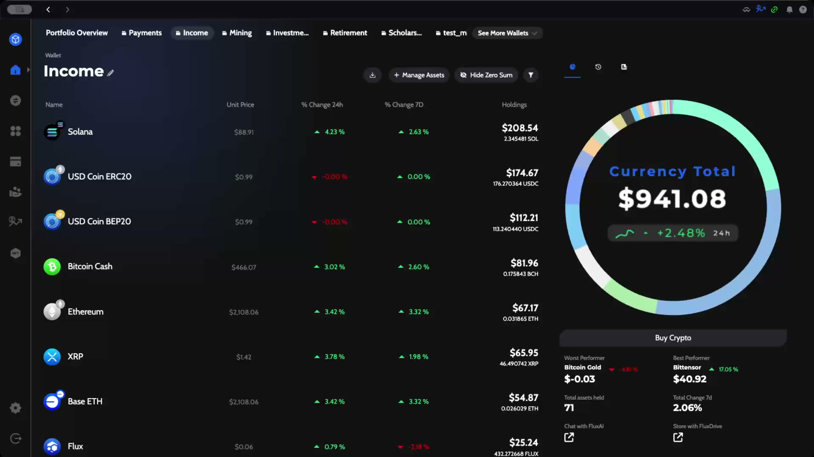
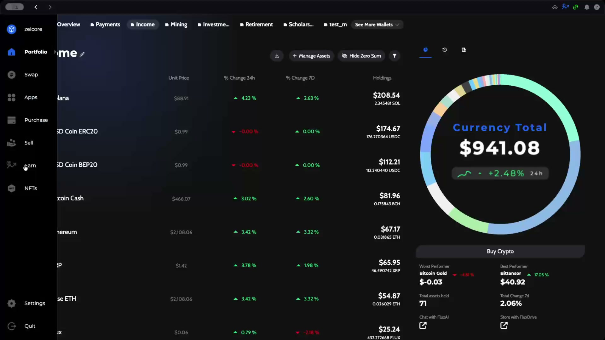
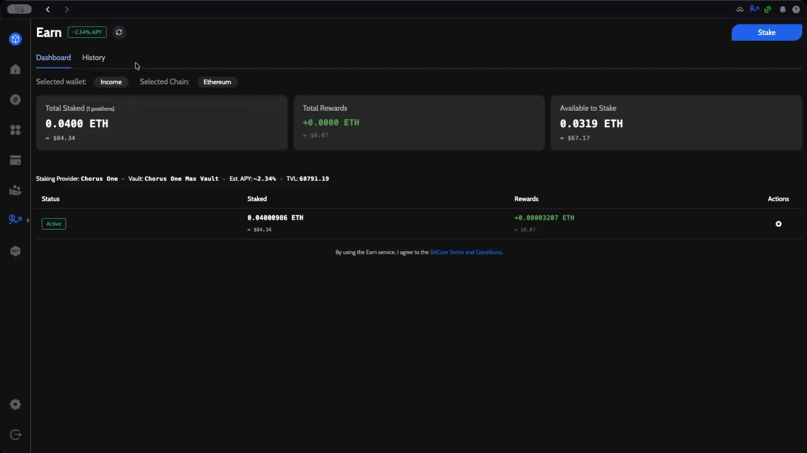
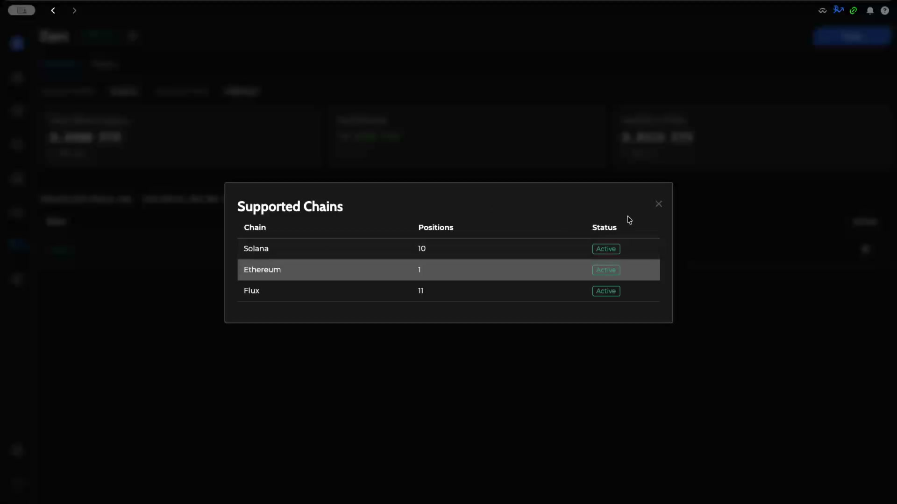
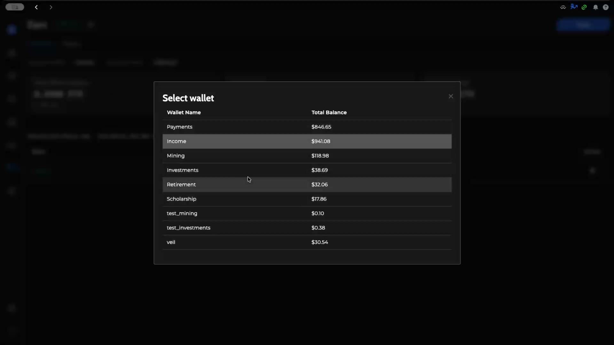
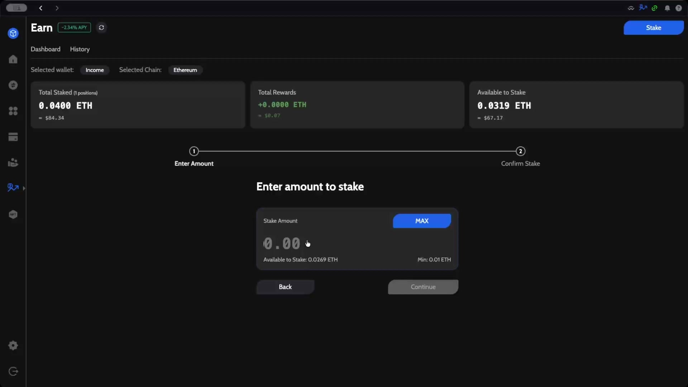
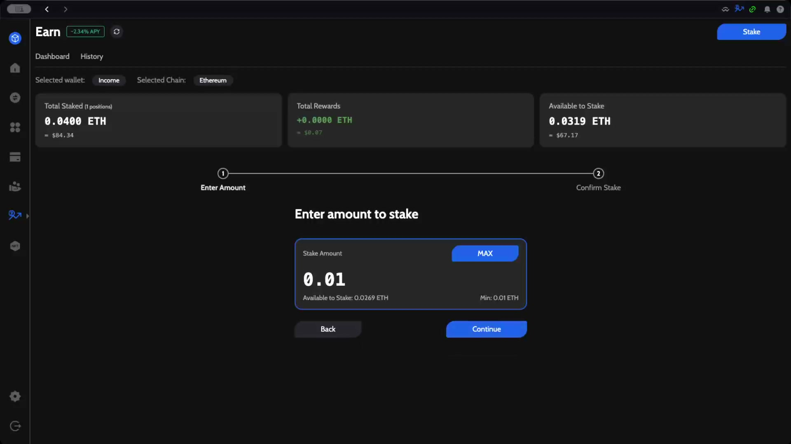
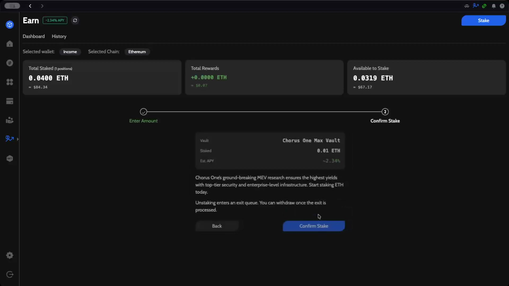
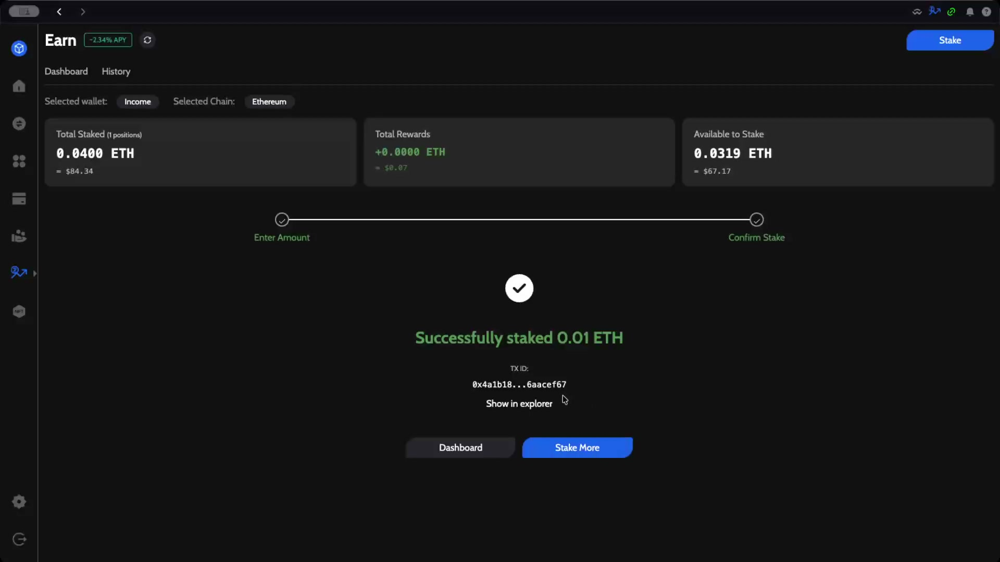
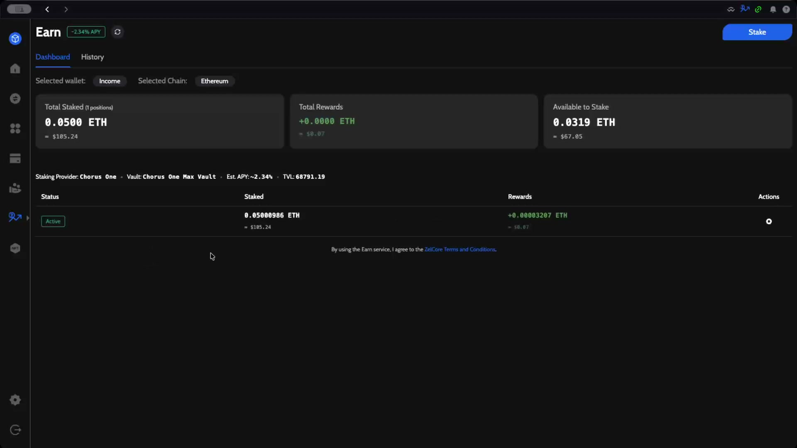

# Stake Ethereum with ZelCore

This guide walks you through staking Ethereum using the **Earn** function in ZelCore. Staking is done through the **Chorus One Max Vault**, a pooled staking solution where Chorus One distributes rewards to participants.

---

## Prerequisites

- ZelCore wallet with ETH available (minimum 0.01 ETH to stake)
- An active Ethereum wallet selected in ZelCore

---

## Step 1: Open the Earn Section

From the ZelCore **Portfolio** dashboard, expand the left sidebar and click **Earn**.

You can also access Earn through the top navigation icon, but the left panel is the most direct route.

---

## Step 2: Review Your Staking Dashboard

The Earn dashboard displays your current staking overview for the selected chain.

Key information shown:

| Field | Description |
|-------|-------------|
| **Total Staked** | Total amount of ETH currently staked across all positions |
| **Total Rewards** | Accumulated staking rewards |
| **Available to Stake** | ETH balance available for staking |
| **Staking Provider** | Chorus One |
| **Vault** | Chorus One Max Vault |
| **Est. APY** | ~2.34% (variable based on network conditions) |
| **TVL** | Total value locked in the vault |

:::info
The Earn section currently supports staking on **Ethereum**, **Solana**, and **Flux**. You can switch between chains by clicking the **Selected Chain** dropdown.
:::

You can also switch wallets by clicking the **Selected wallet** badge. Each wallet has its own staking positions.

---

## Step 3: Enter Stake Amount

Click the **Stake** button in the top-right corner. This opens the staking wizard.

Enter the amount of ETH you want to stake. You can also click **MAX** to stake your full available balance.

:::tip
The minimum stake amount is **0.01 ETH**. The available balance shown accounts for gas fees needed for the transaction.
:::

Click **Continue** to proceed to the confirmation step.

---

## Step 4: Review and Confirm

Review the staking details before confirming.

| Detail | Value |
|--------|-------|
| **Vault** | Chorus One Max Vault |
| **Staked** | 0.01 ETH |
| **Est. APY** | ~2.34% |

Chorus One's MEV research ensures high yields with top-tier security and enterprise-level infrastructure.

:::warning
Unstaking enters an exit queue. You can withdraw once the exit is processed.
:::

Click **Confirm Stake** to submit the transaction. The button will show a loading state while the transaction is being processed on-chain.

---

## Step 5: Transaction Confirmation

Once the transaction is confirmed on the blockchain, a success screen appears with the transaction details.

From here you can:

- Click **Show in explorer** to view the transaction on the blockchain explorer
- Click **Stake More** to add another staking position
- Click **Dashboard** to return to the Earn overview

---

## Step 6: Verify Your Updated Position

Back on the dashboard, your staking position now reflects the newly staked amount. Rewards will begin accruing shortly.

Your position status shows as **Active**, and you can track your accumulated rewards in the **Rewards** column.

---

## Summary

You have successfully staked ETH using ZelCore's Earn function. Your ETH is now staked in the Chorus One Max Vault, earning an estimated ~2.34% APY. Rewards are distributed automatically by Chorus One to all pool participants and will appear in your Rewards balance over time.
