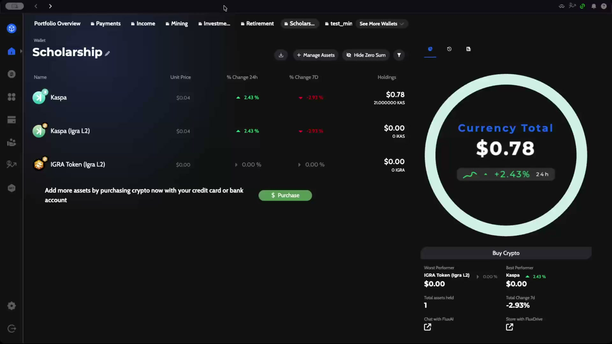
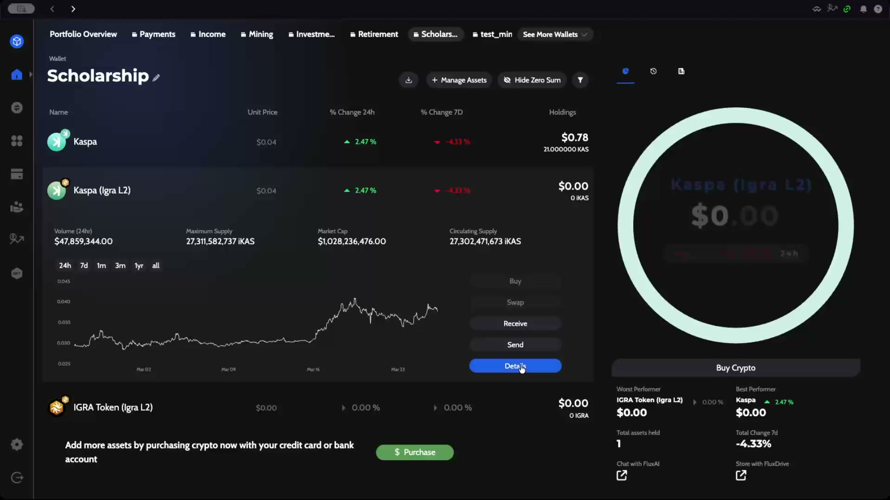
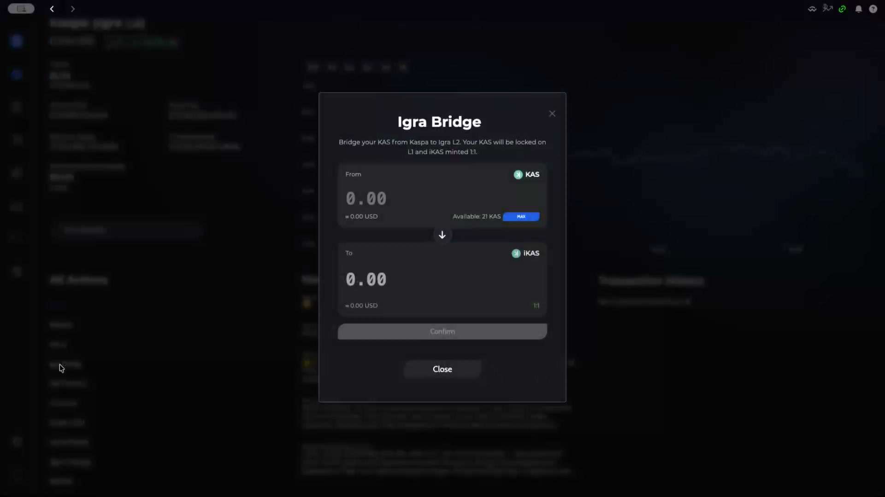
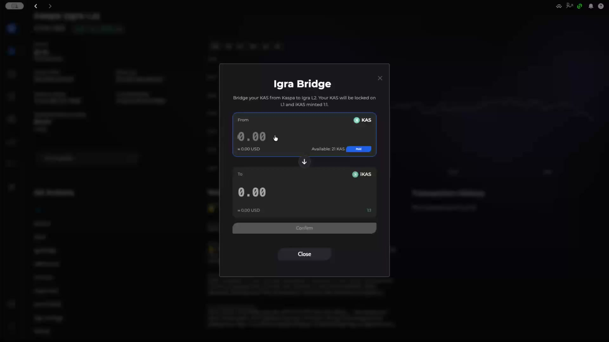
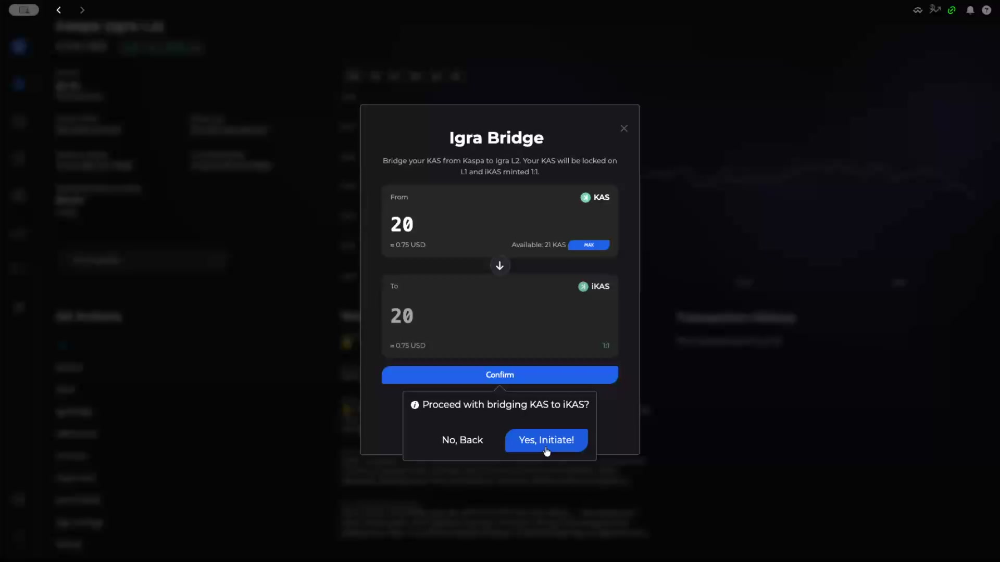
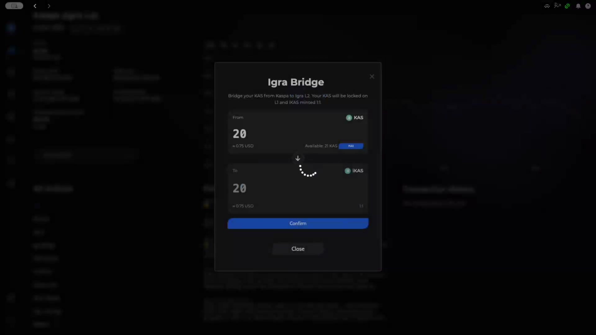
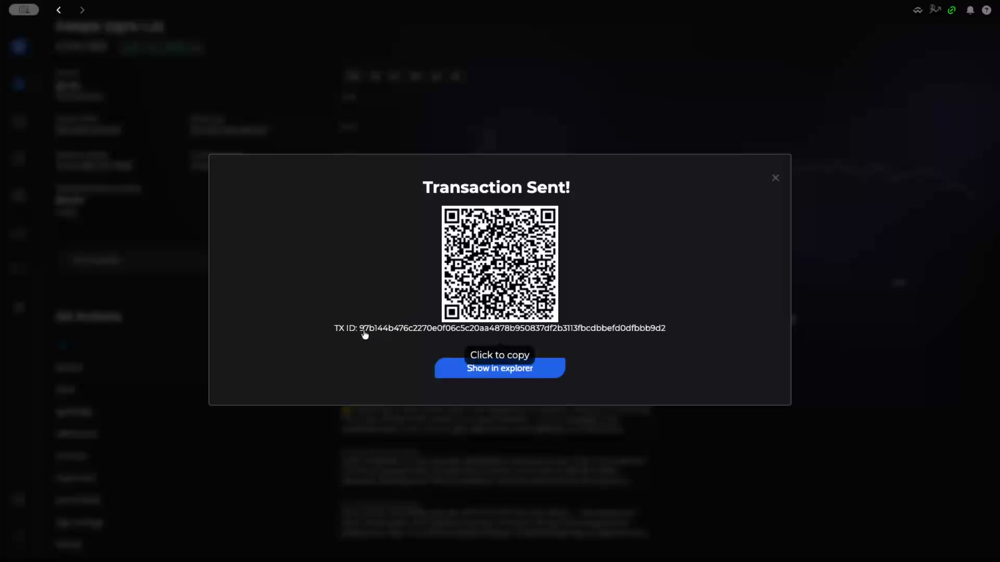
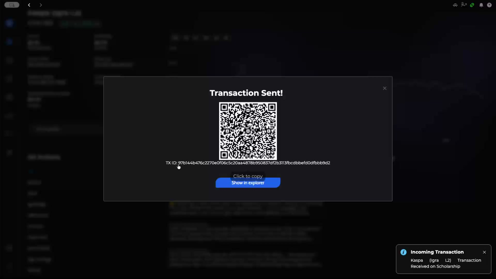
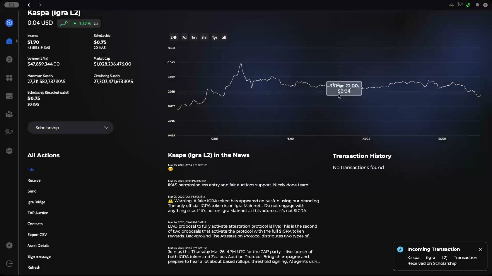
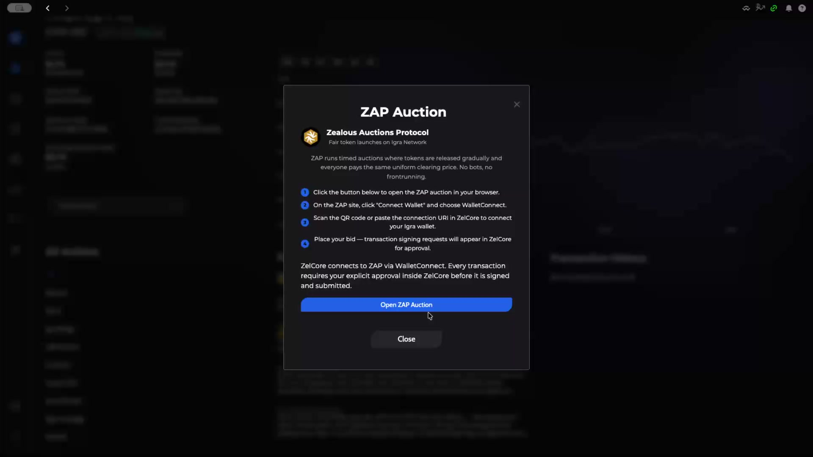

# How to Bridge KAS to Igra L2 Using the Igra Bridge

This guide walks you through bridging your Kaspa (KAS) tokens to Igra L2 (iKAS) using ZelCore's built-in Igra Bridge. The bridge locks your KAS on L1 and mints iKAS on Igra L2 at a 1:1 ratio. You'll also get a brief look at the ZAP Auction feature available on Igra L2.

---

## Prerequisites

- A ZelCore wallet with KAS tokens
- ZelCore desktop application installed and logged in
- Kaspa (Igra L2) asset added to your portfolio

---

## Step 1: Open Your Portfolio

Start from the **Portfolio Overview** in ZelCore. Your wallet displays all added assets along with their current balances, 24-hour price changes, and 7-day trends.

In this example, the **Scholarship** wallet holds three Kaspa-related assets:

| Asset | Description |
|-------|-------------|
| **Kaspa** | Native KAS on Layer 1 |
| **Kaspa (Igra L2)** | iKAS on the Igra Layer 2 network |
| **IGRA Token (Igra L2)** | The IGRA governance token on Igra L2 |

---

## Step 2: Expand the Kaspa (Igra L2) Asset

Click on **Kaspa (Igra L2)** in your portfolio to expand its details. This reveals market data, a price chart, and action buttons.

The expanded view shows:

- **Volume (24h)**, **Maximum Supply**, **Market Cap**, and **Circulating Supply**
- A price chart with selectable timeframes (24h, 7d, 1m, 3m, 1yr, all)
- Action buttons: **Buy**, **Swap**, **Receive**, **Send**, and **Details**

Click **Details** to navigate to the full asset details page where the Igra Bridge is available.

---

## Step 3: Open the Igra Bridge

On the Kaspa (Igra L2) details page, find **Igra Bridge** in the **All Actions** menu on the left side. Click it to open the bridge modal.

The Igra Bridge modal displays:

- **From** field — KAS (Layer 1), showing your available balance
- **To** field — iKAS (Igra L2), automatically calculated at a 1:1 ratio
- Your available KAS balance (in this case, 21 KAS)
- A **MAX** button to bridge your entire balance
- A **Confirm** button (grayed out until an amount is entered)

---

## Step 4: Enter the Amount to Bridge

Click the **From** field and enter the amount of KAS you want to bridge. The **To** field automatically mirrors the amount since the bridge uses a 1:1 ratio.

:::tip
Use the **MAX** button to bridge your entire KAS balance in one transaction. Keep in mind that you may want to retain a small amount for future L1 transaction fees.
:::

---

## Step 5: Confirm the Bridge Transaction

After entering your desired amount (20 KAS in this example), the **Confirm** button becomes active. Click it to initiate the bridge.

A confirmation dialog appears asking **"Proceed with bridging KAS to iKAS?"** with two options:

- **No, Back** — Cancel and return to the bridge form
- **Yes, Initiate!** — Proceed with the bridge transaction

Click **Yes, Initiate!** to submit the transaction.

---

## Step 6: Wait for Transaction Processing

After confirming, a loading spinner appears while the transaction is being processed and broadcast to the network.

This typically takes just a few seconds.

---

## Step 7: Transaction Confirmation

Once the transaction is successfully sent, a **"Transaction Sent!"** screen appears with:

- A **QR code** for the transaction
- The **TX ID** (transaction hash) for reference
- A **Click to copy** option for the TX ID
- A **Show in explorer** button to view the transaction on the blockchain explorer

Shortly after, you'll receive an **Incoming Transaction** notification confirming that the iKAS has been received in your wallet.

---

## Step 8: Verify Your Updated Balance

Navigate back to the Kaspa (Igra L2) details page. Your **Scholarship** wallet balance now reflects the bridged amount.

In this example, the wallet now shows:

- **Scholarship**: $0.75 / 20 iKAS
- **Income**: $1.70 / 45.55 iKAS

The details page also provides access to all available actions for iKAS, including **Info**, **Receive**, **Send**, **Igra Bridge**, **ZAP Auction**, **Contacts**, **Export CSV**, **Asset Details**, **Sign message**, and **Refresh**.

---

## Bonus: ZAP Auction

From the Kaspa (Igra L2) details page, click **ZAP Auction** to access the **Zealous Auctions Protocol** — a fair token launch platform on the Igra Network.

ZAP runs timed auctions where tokens are released gradually and everyone pays the same uniform clearing price. No bots, no frontrunning.

To participate:

1. Click **Open ZAP Auction** to open the auction site in your browser
2. On the ZAP site, click **Connect Wallet** and choose **WalletConnect**
3. Scan the QR code or paste the connection URI in ZelCore to connect your Igra wallet
4. Place your bid — transaction signing requests will appear in ZelCore for approval

:::info
ZelCore connects to ZAP via WalletConnect. Every transaction requires your explicit approval inside ZelCore before it is signed and submitted.
:::

---

## Summary

You've successfully bridged KAS from Kaspa Layer 1 to iKAS on Igra Layer 2 using ZelCore's built-in Igra Bridge. Your KAS is locked on L1 and an equivalent amount of iKAS is minted on Igra L2 at a 1:1 ratio.

With iKAS on Igra L2, you can now:

- **Send** and **Receive** iKAS on the Igra network
- Participate in **ZAP Auctions** for fair token launches
- Explore the growing Igra L2 ecosystem directly from ZelCore
