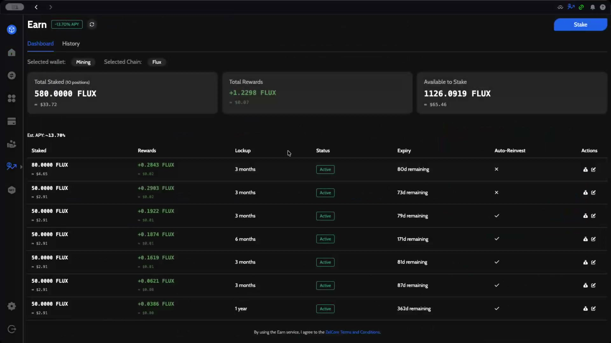
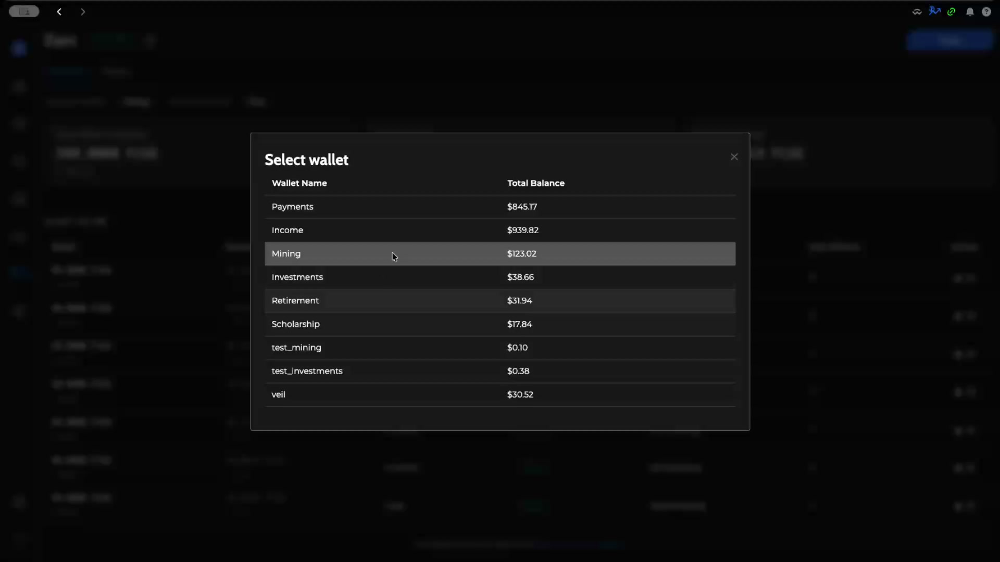
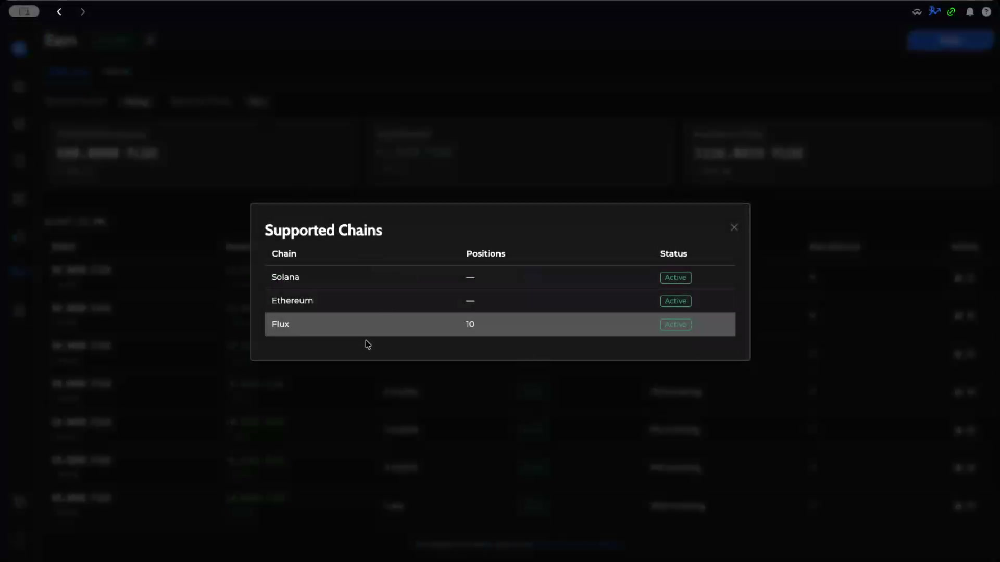
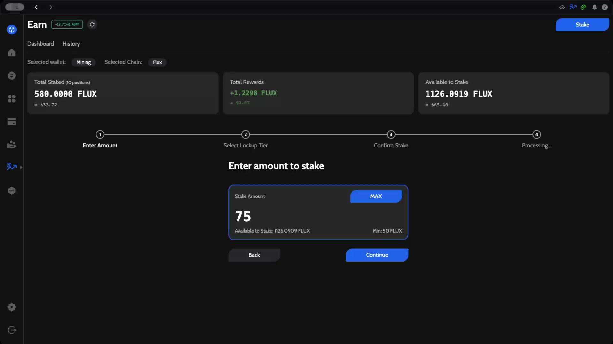
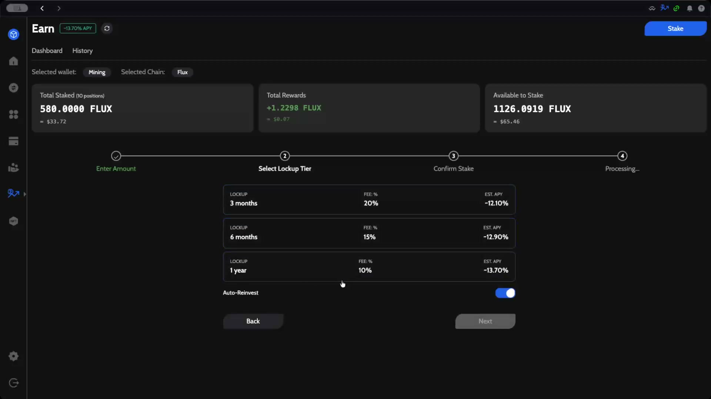
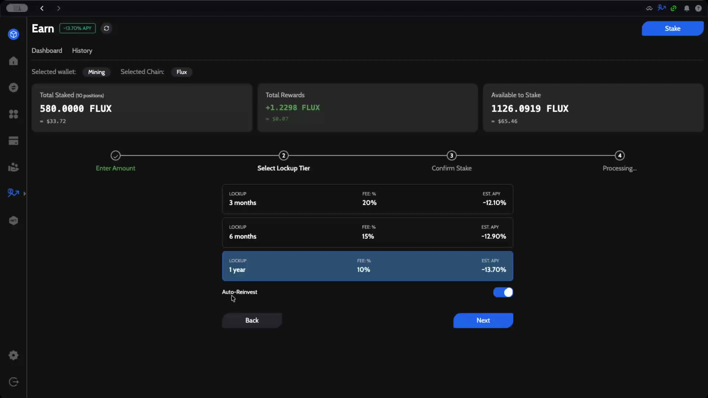
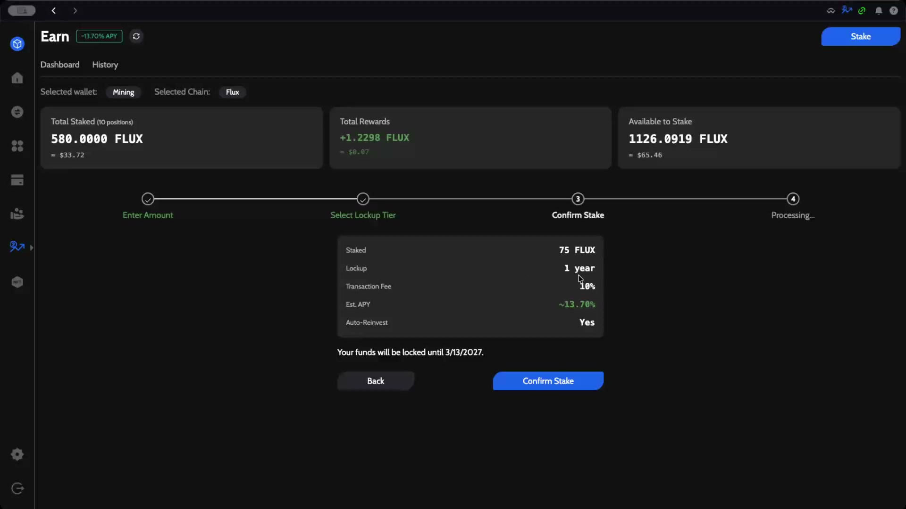
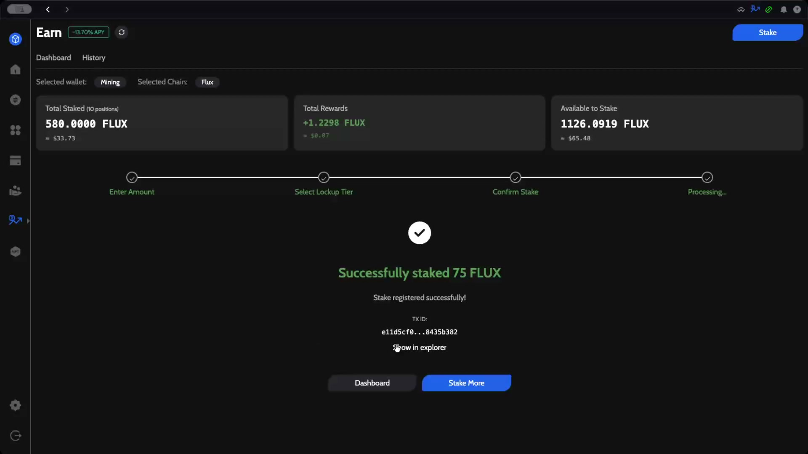
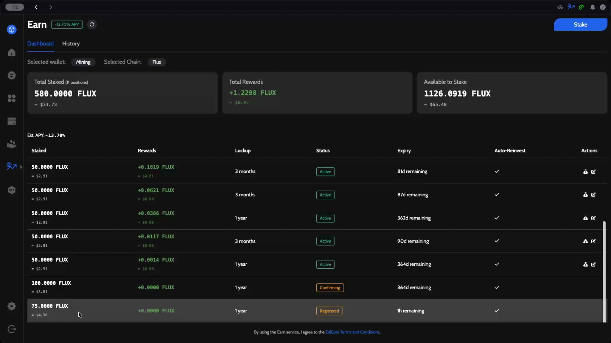

# How to Stake FLUX with ZelCore Earn

This guide walks you through staking FLUX using ZelCore's Earn feature. You'll learn how to navigate to Earn, select a wallet and chain, choose a lockup tier, and confirm your stake.

---

## Prerequisites

- A ZelCore wallet with FLUX tokens (minimum 50 FLUX to stake)
- ZelCore desktop application installed and logged in

---

## Step 1: Open the Earn Feature

Navigate to the **Earn** section using the side panel on the left. Click the **Earn** icon to open the staking dashboard.

The Earn dashboard displays an overview of your staking activity:

- **Total Staked** — The total amount of FLUX currently staked across all positions
- **Total Rewards** — Accumulated staking rewards
- **Available to Stake** — Your remaining unstaked FLUX balance
- **Est. APY** — The current estimated annual percentage yield

The dashboard also lists all your active staking positions with their lockup period, status, expiry, and Auto-Reinvest setting.

:::info
The Earn page has two tabs: **Dashboard** for managing your stakes and **History** for reviewing past staking transactions.
:::

---

## Step 2: Select a Wallet and Chain

Before staking, you need to select which wallet to stake from and which blockchain to use.

### Select Wallet

Click on the **Selected wallet** dropdown to choose the wallet containing your FLUX.

Each wallet displays its name and total balance, making it easy to choose the right one.

### Select Chain

Click on the **Selected Chain** dropdown to view supported chains.

ZelCore Earn currently supports staking on the following chains:

| Chain | Status |
|-------|--------|
| Solana | Active |
| Ethereum | Active |
| Flux | Active |

Select **Flux** to stake FLUX tokens.

---

## Step 3: Enter the Stake Amount

Click the **Stake** button in the top-right corner to begin the staking process. The wizard walks you through four steps: Enter Amount, Select Lockup Tier, Confirm Stake, and Processing.

Enter the amount of FLUX you want to stake. You can also click **MAX** to stake your full available balance.

:::tip
The minimum stake amount is **50 FLUX**. Your available balance is shown below the input field.
:::

Click **Continue** to proceed.

---

## Step 4: Select a Lockup Tier

Choose your preferred lockup period. Longer lockup periods offer lower fees and higher estimated APY.

| Lockup Period | Fee % | Est. APY |
|---------------|-------|----------|
| 3 months | 20% | ~12.10% |
| 6 months | 15% | ~12.90% |
| 1 year | 10% | ~13.70% |

Select your preferred tier. In this example, we select **1 year** for the lowest fee and highest APY.

### Auto-Reinvest

The **Auto-Reinvest** toggle automatically re-stakes your rewards when they are distributed. This is enabled by default and can be toggled on or off based on your preference.

:::tip
Enabling Auto-Reinvest compounds your staking rewards over time, maximizing your returns.
:::

Click **Next** to proceed.

---

## Step 5: Confirm Your Stake

Review the summary of your staking configuration before confirming.

| Setting | Value |
|---------|-------|
| Staked | 75 FLUX |
| Lockup | 1 year |
| Transaction Fee | 10% |
| Est. APY | ~13.70% |
| Auto-Reinvest | Yes |

:::warning
Your funds will be locked until the lockup period expires. In this example, funds are locked until **3/13/2027**. You will not be able to withdraw them before this date.
:::

:::info
The **Transaction Fee** is a fee deducted from your staking rewards, not an upfront charge on your staked amount.
:::

Click **Confirm Stake** to submit your staking transaction.

---

## Step 6: Staking Confirmation

After submitting, the transaction is processed and you'll see a success screen.

The confirmation displays:
- A **TX ID** for your transaction
- A **Show in explorer** link to view the transaction on the blockchain
- Options to go back to the **Dashboard** or **Stake More**

---

## Verifying Your Stake

After returning to the dashboard, you can see your new staking position in the list. New stakes will initially show a **Confirming** or **Registered** status before transitioning to **Active**.

| Status | Meaning |
|--------|---------|
| Registered | Stake has been submitted and is awaiting processing |
| Confirming | Transaction is being confirmed on the blockchain |
| Active | Stake is live and earning rewards |

---

## Summary

To stake FLUX with ZelCore Earn:

1. **Navigate** to the Earn section from the side panel
2. **Select** your wallet and the Flux chain
3. **Enter** the amount to stake (minimum 50 FLUX)
4. **Choose** a lockup tier based on your preferred duration and APY
5. **Enable/disable** Auto-Reinvest based on your strategy
6. **Confirm** and submit your stake
7. **Monitor** your position on the Earn dashboard

---

*Powered by Flux*
