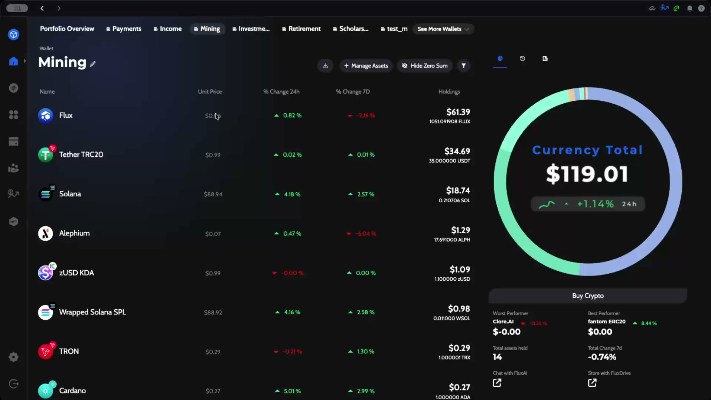
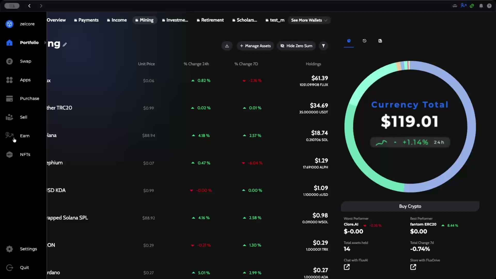
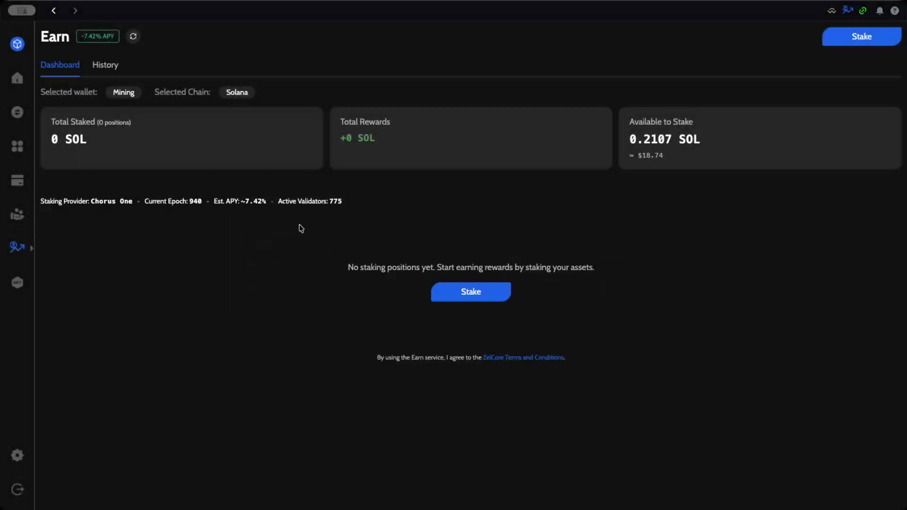
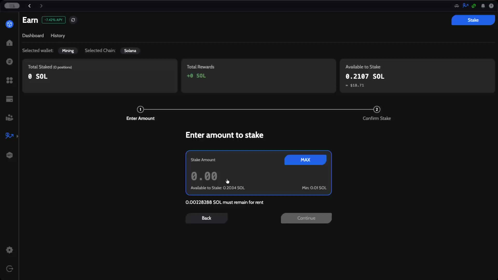
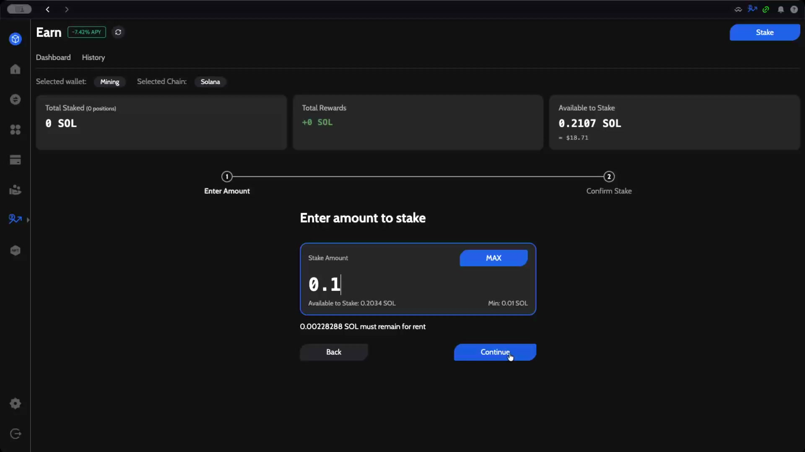
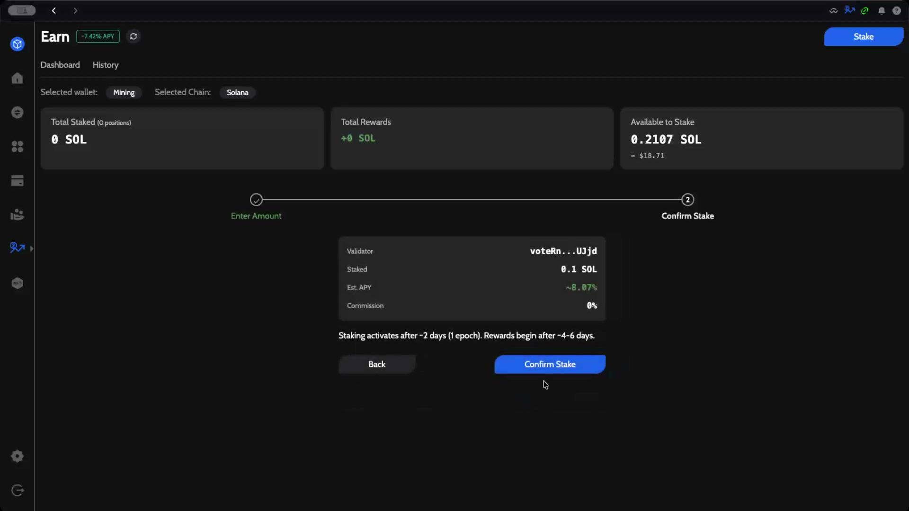
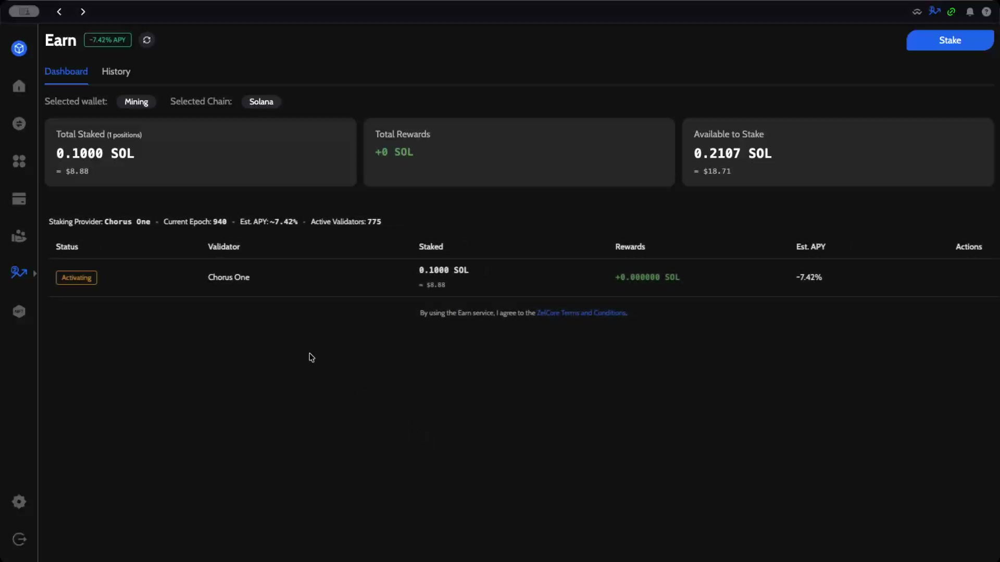

# How to Stake Solana (SOL) with ZelCore Earn

This guide walks you through staking Solana (SOL) using ZelCore's Earn feature. You'll learn how to navigate to Earn, select Solana as the staking chain, enter a stake amount, and confirm your stake through the Chorus One staking provider.

---

## Prerequisites

- A ZelCore wallet with SOL tokens (minimum 0.01 SOL to stake)
- ZelCore desktop application installed and logged in

---

## Step 1: Open the Earn Feature

From your **Portfolio** overview, open the Earn section. The staking function is available from the left side panel through the **Earn** tab, or through the top icon in the navigation bar.

Click **Earn** in the left sidebar to open the staking dashboard.

---

## Step 2: Select Solana as the Staking Chain

On the Earn dashboard, use the **Selected Chain** selector to choose **Solana**. The dashboard displays an overview of your Solana staking activity:

- **Total Staked** — The total amount of SOL currently staked (0 SOL if no positions exist)
- **Total Rewards** — Accumulated staking rewards
- **Available to Stake** — Your unstaked SOL balance available for staking

Below the summary cards, the staking provider details are shown:

| Detail | Value |
|--------|-------|
| Staking Provider | Chorus One |
| Current Epoch | 940 |
| Est. APY | ~7.42% |
| Active Validators | 775 |

:::tip
You can change the selected wallet or chain at any time to view or manage stakes on different networks.
:::

---

## Step 3: Start the Staking Process

Click the **Stake** button to begin. The staking process follows a two-step wizard: **Enter Amount** and **Confirm Stake**.

The staking form displays:

- **Stake Amount** — Input field for the amount of SOL to stake
- **MAX** button — Automatically fills the maximum available amount
- **Available to Stake** — Shows your available SOL balance (e.g., 0.2034 SOL)
- **Min** — The minimum staking amount (0.01 SOL)

:::info
A small amount of SOL (0.00228288 SOL) must remain in your wallet for rent. This is automatically reserved and cannot be staked.
:::

---

## Step 4: Enter the Stake Amount

Enter the amount of SOL you want to stake. In this example, we stake **0.1 SOL** through the Chorus One staking provider. Once a valid amount is entered, the **Continue** button becomes active.

Click **Continue** to proceed to the confirmation step.

---

## Step 5: Review and Confirm the Stake

The confirmation screen displays a summary of your staking details, including the validator, the staked amount, and the estimated APY. Review the information carefully before confirming.

| Detail | Value |
|--------|-------|
| Validator | voteRn...UJjd |
| Staked | 0.1 SOL |
| Est. APY | ~8.07% |
| Commission | 0% |

:::warning
These values are all estimations and depend on the validator, the network conditions, slashing events, and other factors. Actual rewards may vary.
:::

:::info
Staking activates after ~2 days (1 epoch). Rewards begin after ~4-6 days.
:::

Click **Confirm Stake** to submit the staking transaction.

---

## Step 6: Verify Your Staking Position

After confirming, you are returned to the Earn dashboard. Your new staking position appears with an **Activating** status. It should be activated in the next epoch.

The dashboard now reflects your updated staking summary:

- **Total Staked** — 0.1000 SOL (1 position)
- **Status** — Activating
- **Validator** — Chorus One
- **Est. APY** — ~7.42%

Once activated, you will begin earning staking rewards. You can stake again or go back to view your existing positions at any time.

---

## Summary

You have successfully staked SOL using ZelCore's Earn feature. Your stake will activate in the next Solana epoch and begin generating rewards shortly after. Return to the Earn dashboard at any time to monitor your staking positions, view accumulated rewards, or create additional stakes.
