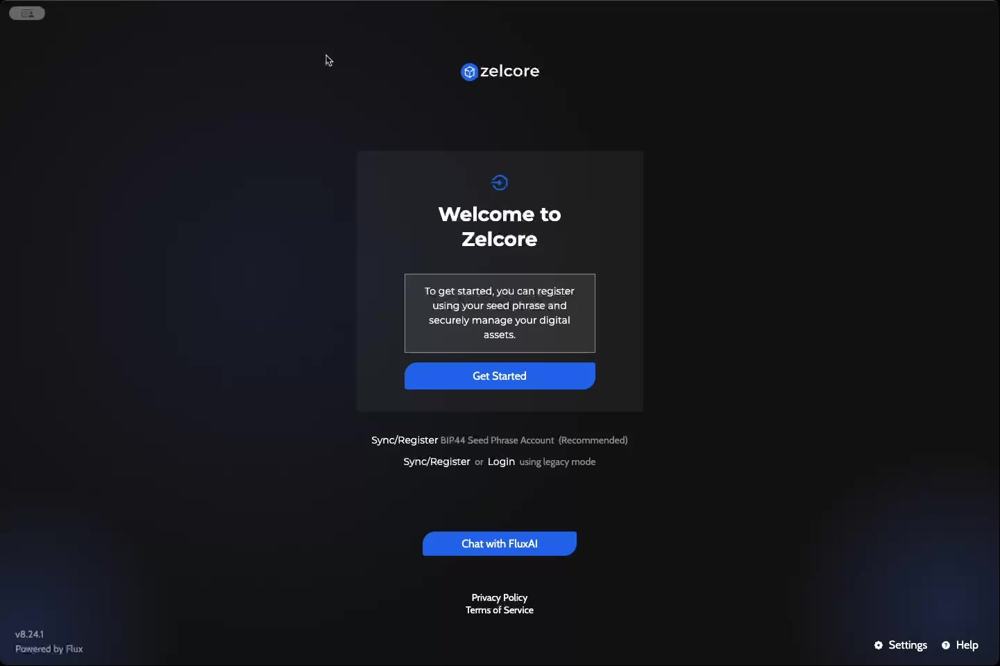
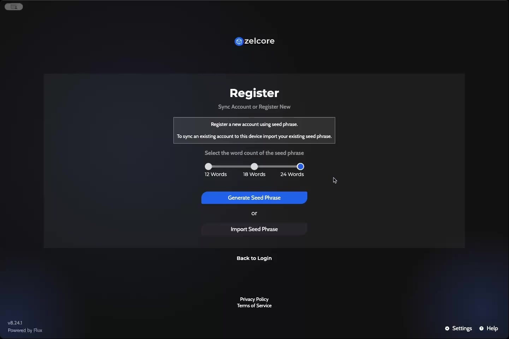
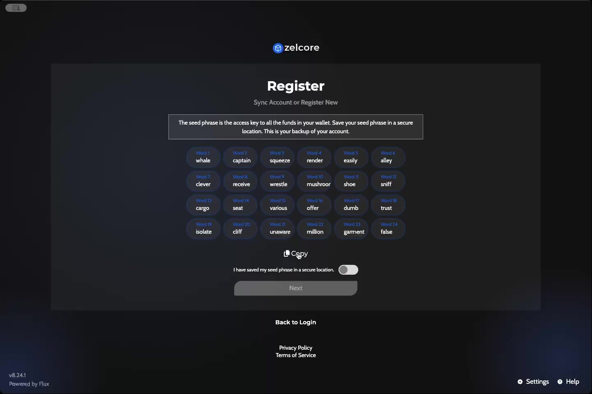
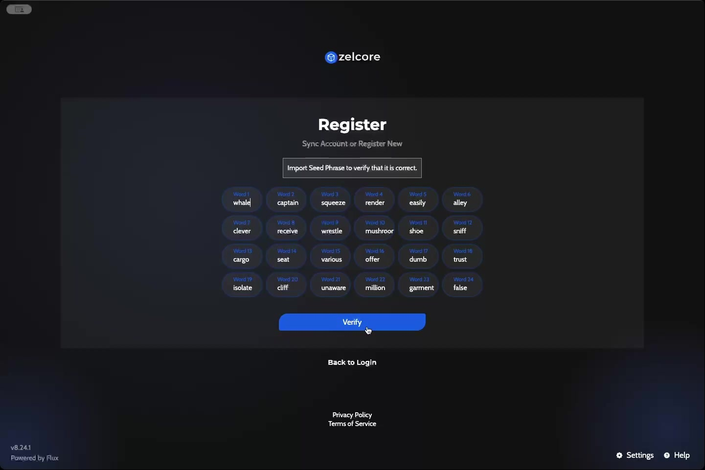
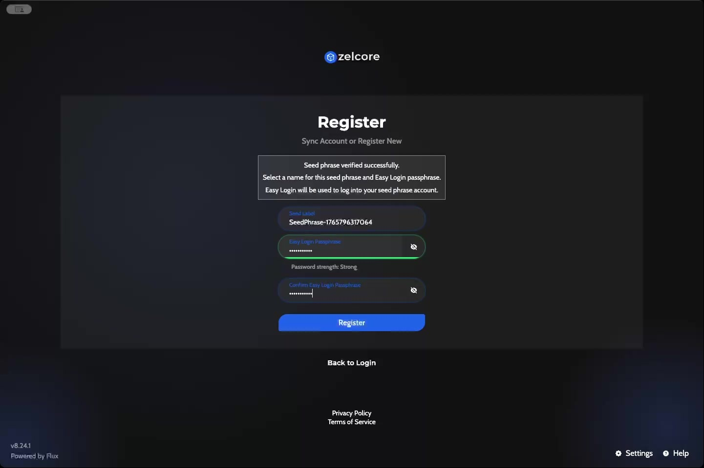
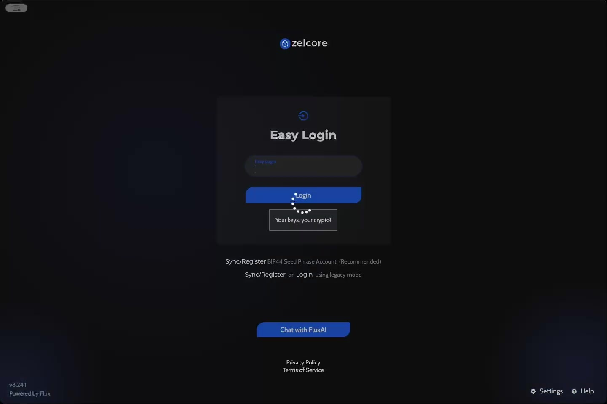
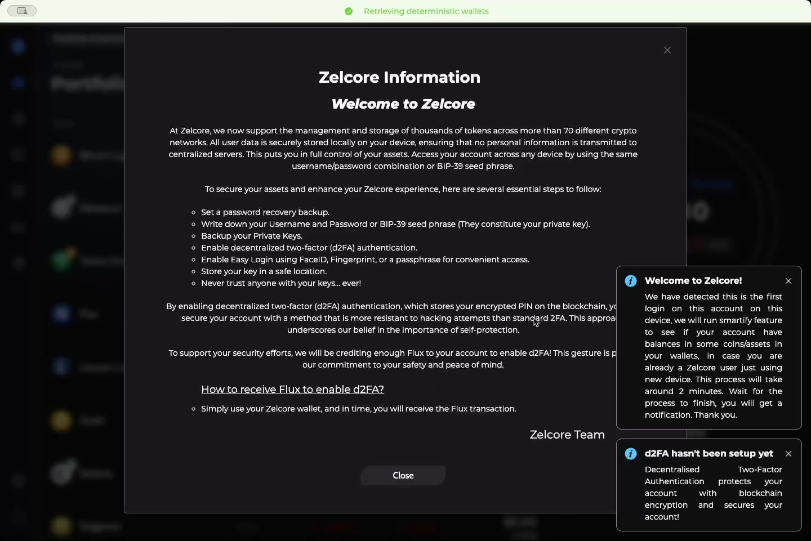
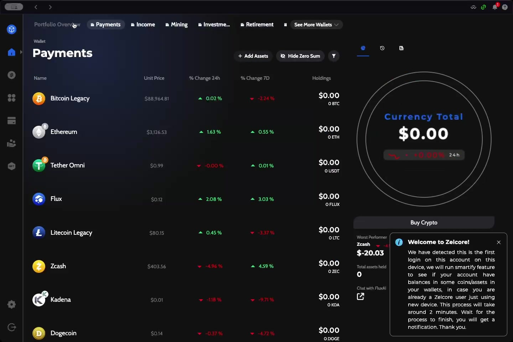

# Zelcore Wallet Setup Guide

This guide walks you through setting up a new Zelcore wallet account, from initial registration to accessing your portfolio.

## Overview

Zelcore is a multi-currency cryptocurrency wallet that supports thousands of tokens across more than 70 different crypto networks. All user data is stored locally on your device, ensuring no personal information is transmitted to centralized servers.

**Version shown:** v8.24.1

---

## Getting Started

### Step 1: Launch Zelcore

When you open Zelcore for the first time, you'll see the Welcome screen with the following options:

- **Get Started** — Begin the registration process
- **Sync/Register** — BIP44 Seed Phrase Account (Recommended)
- **Login using legacy mode** — For existing legacy accounts
- **Chat with FluxAI** — Access AI assistance

Click **"Get Started"** to begin creating a new wallet.

---

## Registration Process

### Step 2: Choose Seed Phrase Length

On the Register screen, you can either create a new wallet or sync an existing one.

**Select the word count for your seed phrase:**

| Option | Security Level |
|--------|---------------|
| 12 Words | Standard |
| 18 Words | Enhanced |
| 24 Words | Maximum (Recommended) |

Choose your preferred length, then click either:
- **Generate Seed Phrase** — Create a new wallet
- **Import Seed Phrase** — Restore an existing wallet

---

### Step 3: Save Your Seed Phrase

:::danger CRITICAL SECURITY STEP
Your seed phrase is the master key to all funds in your wallet. Handle it with extreme care.
:::

**Security requirements:**
1. Write down every word in the exact order shown
2. Store the phrase in a secure, offline location
3. Never share your seed phrase with anyone
4. Never store it digitally (screenshots, cloud storage, etc.)

The interface displays each word numbered (Word 1 through Word 24). Use the **Copy** button if needed, but ensure you have a physical backup.

Toggle the checkbox: **"I have saved my seed phrase in a secure location"**

Click **Next** to proceed.

---

### Step 4: Verify Your Seed Phrase

Zelcore requires you to verify your seed phrase by importing it back.

1. Enter your seed phrase words in the correct order
2. Click **Verify** to confirm

This ensures you have correctly recorded your backup before proceeding.

---

### Step 5: Create Easy Login Credentials

After successful verification, you'll see: **"Seed phrase verified successfully."**

Now create your login credentials:

| Field | Description |
|-------|-------------|
| **Seed Label** | A name for this wallet (auto-generated, e.g., "SeedPhrase-1765796317064") |
| **Easy Login Passphrase** | Your daily login password |
| **Confirm Easy Login Passphrase** | Re-enter to confirm |

**Password requirements:**
- Aim for "Strong" password strength indicator
- Use a unique passphrase you haven't used elsewhere
- This passphrase will be used for quick login access

Click **Register** to complete account creation.

---

## Logging In

### Easy Login

After registration, you'll be taken to the Easy Login screen:

1. Enter your **Easy Login Passphrase**
2. Click **Login**

The tagline "Your keys, your crypto!" reminds you that Zelcore is a non-custodial wallet.

---

## Main Interface

### First Login Experience

On first login, Zelcore displays important information:

**Welcome Modal:**
- Overview of Zelcore's capabilities (70+ crypto networks)
- Security recommendations
- d2FA (decentralized two-factor authentication) setup prompt

**Smartify Feature:**
- Automatically scans for existing balances across networks
- Useful when restoring a wallet on a new device
- Takes approximately 2 minutes to complete

---

### Portfolio Overview

The main dashboard shows:

**Navigation Tabs:**
- Portfolio Overview
- Payments
- Income
- Mining
- Investments
- Retirement
- Scholarship
- See More Wallets

**Asset List Columns:**
| Column | Description |
|--------|-------------|
| Name | Cryptocurrency name and icon |
| Unit Price | Current market price |
| % Change 24h | Daily price movement |
| % Change 7D | Weekly price movement |
| Holdings | Your balance for each asset |

**Supported Assets (examples):**
- Bitcoin Legacy
- Ethereum
- Tether Omni (USDT)
- Flux
- Litecoin Legacy
- Zcash
- Kadena
- Dogecoin
- And many more...

**Quick Actions:**
- **+ Add Assets** — Add new cryptocurrencies to track
- **Hide Zero Sum** — Filter out assets with no balance
- **Buy Crypto** — Purchase cryptocurrency directly

---

## Security Recommendations

Zelcore recommends these essential steps to secure your account:

1. Set a password recovery backup
2. Write down your Username and Password or BIP-39 seed phrase (they constitute your private key)
3. Backup your Private Keys
4. Enable decentralized two-factor (d2FA) authentication
5. Enable Easy Login using FaceID, Fingerprint, or a passphrase
6. Store your key in a safe location
7. Never trust anyone with your keys... ever!

### About d2FA (Decentralized Two-Factor Authentication)

d2FA stores your encrypted PIN on the blockchain, providing:
- Enhanced security compared to standard 2FA
- Resistance to hacking attempts
- Blockchain-based encryption

**How to receive Flux for d2FA:**
Simply use your Zelcore wallet, and you will receive the Flux transaction in time.

---

## Wallet Organization

Zelcore allows you to organize your assets into different wallet categories:

| Wallet Type | Use Case |
|-------------|----------|
| Payments | Day-to-day transactions |
| Income | Received payments and earnings |
| Mining | Mining rewards |
| Investments | Long-term holdings |
| Retirement | Retirement savings |
| Scholarship | Educational funds |

You can also:
- **Import a Wallet** — Add existing wallets
- **Configure Wallet** — Adjust wallet settings
- **Edit Wallet** — Modify wallet details

---

## Additional Features

**Bottom Left Corner:**
- Settings
- Help

**Additional Resources:**
- Privacy Policy
- Terms of Service

---

## Summary

Setting up Zelcore involves:

1. **Generate** a secure seed phrase (24 words recommended)
2. **Backup** your seed phrase securely offline
3. **Verify** your seed phrase
4. **Create** an Easy Login passphrase
5. **Explore** the Portfolio Overview and wallet features
6. **Enable** d2FA for enhanced security

Your Zelcore wallet is now ready to manage cryptocurrencies across multiple blockchain networks!

---

*Powered by Flux*
